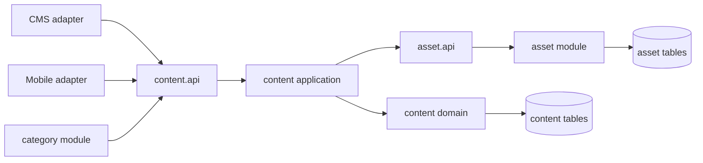
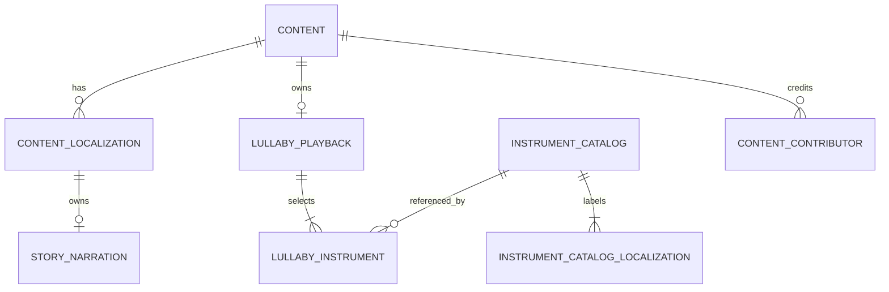

# Architecture Spine — Localized Story Audio and Shared Lullaby Playback

## Design Paradigm

The existing Spring Modulith modular monolith remains the paradigm. `content` owns editorial identity, localizations, playback intent and read projections; `asset` owns media registration and processing. `category` curates only canonical content types. CMS and mobile are adapters over `content` APIs.



## Invariants & Rules

### AD-1 — Content owns the experience model [ADOPTED]

- **Binds:** CAP-1, CAP-2, CAP-3, CAP-4
- **Prevents:** `asset` or `category` becoming a second owner of playback/editorial state.
- **Rule:** `content` owns story audio-experience eligibility, shared lullaby playback and instrument selections. It calls only `asset.api` for asset validation, processing and resolved delivery references. `category` consumes canonical content references through `content.api` and never owns experience state.

### AD-2 — Story audio is a localization-scoped projection [ADOPTED]

- **Binds:** story-audio CAP-1, CAP-2, CAP-3
- **Prevents:** duplicate `Content` identities and `AUDIO_STORY` category types for the same narrative work.
- **Rule:** A narrated counterpart of a `STORY` stays on the same `Content` ID. `StoryNarration` is an optional aggregate child of `ContentLocalization`, holding one full-story audio asset ID, duration and localization-scoped processing target. Existing `StoryPageLocalization` audio remains page-read-aloud media and never establishes `AUDIO_STORY` availability. Public discovery represents the entry point with `canonicalType: STORY` plus `experienceType: READING | AUDIO_STORY`; `AUDIO_STORY` is never persisted as a canonical content or category type.

### AD-3 — Lullaby playback is content-scoped [ADOPTED]

- **Binds:** lullaby CAP-1, CAP-3, CAP-4
- **Prevents:** divergent audio, cover, duration and credit data between localizations of one instrumental lullaby.
- **Rule:** A `LULLABY` has exactly one aggregate-owned shared playback child holding audio asset ID and duration; it reuses `Content.textlessCoverMediaId` as its common cover. Operational processing state remains in `asset`. Its `ContentLocalization` permits title and publication state only; body, description, cover, audio and duration are forbidden. `MUSICIAN` credits are global content contributor assignments.

### AD-4 — Instrument selection is catalog-backed [ADOPTED]

- **Binds:** lullaby CAP-2, CAP-4
- **Prevents:** uncontrolled spelling variants, contributor misuse, duplicate instruments and unstable mobile ordering.
- **Rule:** `content` owns an `InstrumentCatalog` reference aggregate with a stable code. Shared lullaby playback requires one or more catalog instrument IDs plus zero-based `displayOrder`; a content/instrument pair is unique and no free-text instrument is accepted. Instrument records in use cannot be deleted; they may be retired from new selections while remaining resolvable in existing reads.

### AD-5 — Instrument labels are catalog-localized [ADOPTED]

- **Binds:** lullaby CAP-4
- **Prevents:** mobile applications drifting into separate, incompatible instrument translation dictionaries.
- **Rule:** The backend resolves an instrument's `displayName` from an `InstrumentCatalogLocalization` matching the requested locale and returns its stable `code` alongside it. The initial catalog must include every supported mobile language before a referenced instrument can be published.

### AD-6 — Asset processing declares its scope

- **Binds:** story-audio CAP-1, CAP-2; lullaby CAP-1, CAP-4
- **Prevents:** a shared ninni asset being processed once per language or a story-localized output losing its language context.
- **Rule:** `asset` processing commands and records carry an explicit target: `LOCALIZATION(contentId, languageCode)` or `CONTENT(contentId)`. The database enforces separate partial unique keys for each target and allows `language_code` only for the former. `AssetProcessingApi` provides distinct target-typed schedule/read/complete/fail operations, including `findByContent(contentId)`. STORY narration uses `LOCALIZATION`; LULLABY playback uses `CONTENT` and produces one shared delivery set.

### AD-7 — Availability is independently composed

- **Binds:** story-audio CAP-2; lullaby CAP-4
- **Prevents:** a narration processing failure hiding a readable story, or a stale localization processing flag exposing a failed shared lullaby.
- **Rule:** `READING` visibility is evaluated from active content, the requested localization's publication state and existing story-page readiness. `AUDIO_STORY` visibility is evaluated independently from active content, that localization's publication state and its `StoryNarration` processing target completed state. LULLABY visibility requires active content, published title localization and completed `CONTENT(contentId)` playback processing. `content` query services obtain operational status and resolved outputs through `asset.api`; they do not duplicate asset processing state.

### AD-8 — Public reads compose owned fields without duplicating identity

- **Binds:** story-audio CAP-2, CAP-3; lullaby CAP-4
- **Prevents:** mobile clients deriving readiness from missing fields or treating alternate experiences as separate works.
- **Rule:** Public query services compose selected-localization editorial fields with their applicable playback owner and `asset.api` resolution. Story summaries/details include canonical and experience types plus audio readiness. Lullaby summaries/details include localized title and shared `cover`, `audio`, `duration`, global musicians and ordered instruments. Shared fields retain one content ID across locales; collection filtering/pagination occurs in the database before mapping projections.

### AD-9 — CMS follows owner boundaries

- **Binds:** story-audio CAP-1; lullaby CAP-1, CAP-2, CAP-3
- **Prevents:** locale forms reintroducing common lullaby asset fields or new canonical audio-story creation.
- **Rule:** The CMS exposes full-story narration controls only within the relevant story localization. It exposes a single content-level LULLABY playback editor for audio, shared `textlessCoverMediaId`, duration and instrument selection; lullaby locale forms edit title and publication state only. New content creation never offers `AUDIO_STORY`.

### AD-10 — Schema contraction is guarded

- **Binds:** all capabilities
- **Prevents:** loss or silent reclassification of any independently persisted `AUDIO_STORY` or matching category row.
- **Rule:** Before removing canonical `AUDIO_STORY` enum/check-constraint/category or asset-processing support, Flyway validates that no corresponding persisted content, category or processing rows exist and fails otherwise. The migration introduces scoped processing before removing the old localization-only unique key. Bulk import or reconciliation of legacy independent audio stories is a separate feature and is not inferred by this change.

### AD-11 — Textless cover is content-scoped [ADOPTED]

- **Binds:** shared-textless-cover CAP-1, CAP-2, CAP-3
- **Prevents:** one shared cover being duplicated, overwritten or selected inconsistently by localization editors.
- **Rule:** `Content.textlessCoverMediaId` is the single `IMAGE` reference for the audio-story presentation, LULLABY and MEDITATION. Their mobile projections always resolve this reference. CMS manages it at content level; LULLABY and MEDITATION localizations never carry a cover. STORY `READING` always resolves `ContentLocalization.coverMediaId`, because its cover may contain a localized story title.

## Consistency Conventions

| Concern | Convention |
| --- | --- |
| Names | Use `StoryNarration`, `LullabyPlayback`, `InstrumentCatalog`, `InstrumentCatalogLocalization`, `LullabyInstrument`; reserve `experienceType` for public projection, never a JPA `ContentType`. |
| Asset references | Persist only positive media IDs in `content`; resolve URLs through `asset.api` at read time. |
| Processing state | `asset` owns processing state. Its typed target is localization for story narration and content for shared lullaby playback. |
| Public contracts | Keep canonical identity separate from presentation (`canonicalType` / `experienceType`); expose instrument `code` and locale-resolved `displayName`. |
| Covers | Resolve `Content.textlessCoverMediaId` through `asset.api` for LULLABY, MEDITATION and audio-story projections; resolve `ContentLocalization.coverMediaId` for STORY `READING` projections. |
| Mutation and validation | Application services validate referenced asset media type and catalog existence; database constraints enforce non-null required playback fields, unique instrument links and display order. |
| Failure behavior | Failed story narration hides only `AUDIO_STORY`, not `READING`. Failed shared lullaby processing hides all locale projections without changing titles or publication state. |

## Structural Seed



```text
be/src/main/java/com/tellpal/v2/
  content/
    domain/          # Content, LullabyPlayback, catalog and invariant rules
    application/     # content/playback/catalog commands and public query composition
    api/             # module contracts consumed by category and adapters
    web/admin/       # CMS endpoints
    web/mobile/      # mobile response adapters
  asset/api/         # scoped processing and resolved media contracts
  category/          # canonical-type curation only
cms/src/features/contents/
  components/        # content-level lullaby playback editor and title-only locale editor
```

## Capability → Architecture Map

| Capability / Area | Lives in | Governed by |
| --- | --- | --- |
| Story localization narration | `content` localization domain, public query and CMS localization editor | AD-1, AD-2, AD-6, AD-7, AD-8, AD-9 |
| Shared lullaby playback | `content` aggregate and `asset.api` processing | AD-1, AD-3, AD-6, AD-7 |
| Instrument catalog and selection | `content` catalog/application/CMS editor | AD-3, AD-4, AD-5, AD-9 |
| Mobile discovery and player data | `content` public query/mobile adapters | AD-2, AD-5, AD-7, AD-8 |
| Safe schema transition | Flyway plus content/category/asset constraints | AD-10 |
| Shared textless covers | `content` domain, CMS content editor and public query | AD-1, AD-11 |

## Deferred

- Catalog-management roles and approval workflow: this feature requires catalog selection, not catalog-administration UX.
- A legacy independent `AUDIO_STORY` import/reconciliation workflow: explicitly outside both driving specs.
- Existing canonical architecture and ADR-0007 update: ratify this spine first, then record it in a new/superseding ADR and project memory before implementation.
- Whether public response compatibility is versioned by endpoint, media type, or a temporary response field: implementers must preserve existing clients while API owners select the rollout mechanism.
