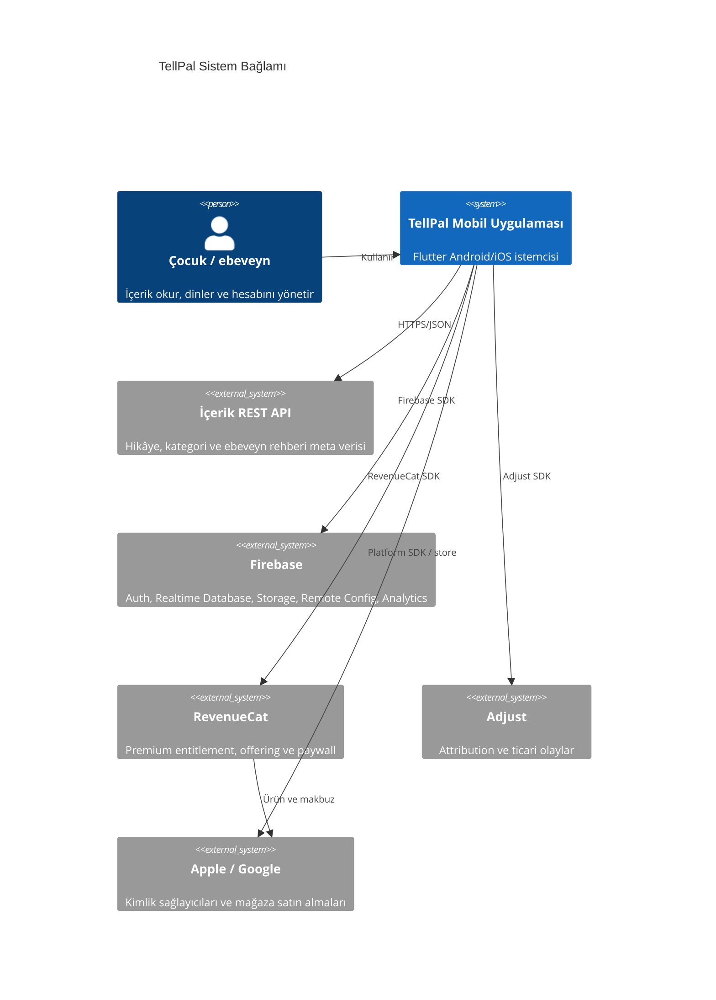
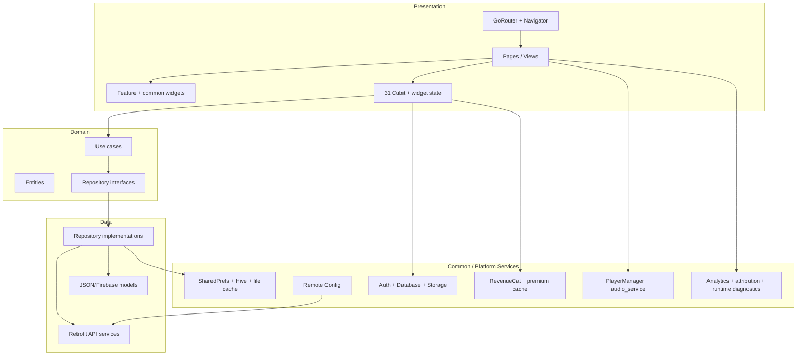
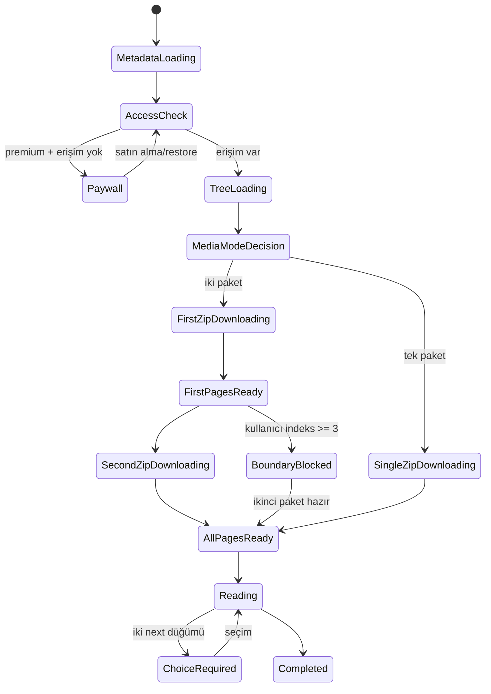
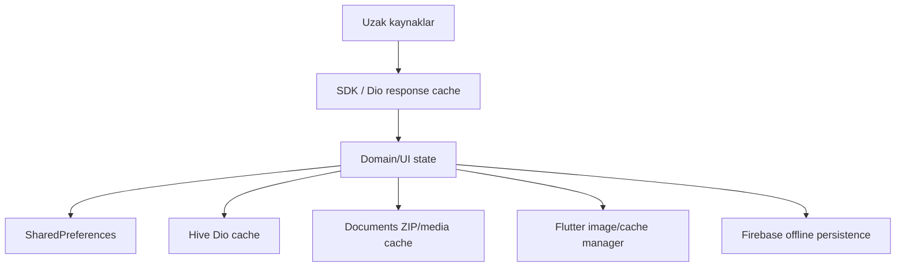
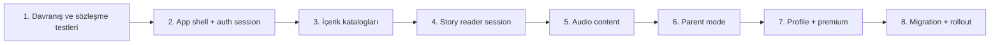

# TellPal Teknik Mimari

**Tarih:** 2026-07-28  
**Sistem tipi:** Flutter mobil istemci  
**Platformlar:** Android ve iOS  
**Mimari yaklaşım:** Feature tabanlı, kısmen katmanlı Clean Architecture

## 1. Yönetici Özeti

TellPal; çocuk hikâyeleri, ninni/meditasyon/sesli içerikler ve ebeveyn rehberleri sunan
tek bir Flutter uygulamasıdır. Uygulama backend kodunu içermez. İçerik meta verisini REST
API'den, kullanıcı ve davranış verisini Firebase'den, büyük medya paketlerini Firebase
Storage'dan, premium erişimi RevenueCat'ten alır.

Kod tabanı `features` altında ürün alanlarına ayrılmıştır. Stories ve parent_mode
feature'larında `presentation → domain → data` katmanları belirgindir; auth, profile ve
relax daha kısmi katmanlanmıştır. State BLoC/Cubit ile, bağımlılıklar GetIt ile,
navigasyon GoRouter ve yer yer Flutter Navigator ile yönetilir.

Sistemin en önemli teknik gerçeği şudur: kullanıcıya görünen tek hikâye okuma deneyimi
REST, Remote Config, RevenueCat, Firebase Storage, yerel dosya sistemi, iki Cubit, widget
state'i, audio ve Realtime Database geçmiş kaydının birleşimidir. Bu çapraz servis
bağımlılığı mevcut yeniden geliştirme çalışmasının ana risk alanıdır.

## 2. Sistem Bağlamı



## 3. Mobil Uygulama Konteynerleri



Katman yönü stories ve parent_mode için bu şemaya yakındır. Auth ve profil işlemlerinin
bir bölümü Cubit/ekrandan ortak Firebase servislerine daha doğrudan gider. Bu yüzden
“Clean Architecture” bir repository genelinde tam invariant değil, baskın bir
organizasyon örüntüsüdür.

## 4. Başlangıç ve Composition Root

`lib/main.dart` şu görevleri başlatır:

1. Flutter binding ve Firebase.
2. Remote Config.
3. GetIt bağımlılık grafiği.
4. RevenueCat'in gecikmeli/arka plan başlatılması.
5. Remote Config izin veriyorsa Analytics ve Adjust.
6. Global Flutter/platform async hata yakalama.
7. Lazy Cubit konfigürasyonu.
8. Performans ve startup diagnostikleri.
9. Ertelenmiş başlangıç görevleri.
10. Audio service yaşam döngüsü.
11. GoRouter tabanlı uygulama ağacı.

### 4.1 Bağımlılık Grafiği

`lib/injection_container.dart` şu sıraya benzer bir graph kurar:

```text
Firebase SDK instances + SharedPreferences
  → common services
  → Dio/cache/interceptors + Retrofit services
  → repository implementations
  → use cases
  → Cubit singleton'ları
```

Firebase Realtime Database offline persistence burada etkinleştirilir. Dio base URL'si
Remote Config'den gelir; dil ve uygulama sürümü header'ları eklenir.

### 4.2 Yaşam Döngüsü

GetIt Cubit'leri singleton kaydeder. `LazyMultiBlocProvider` bunları widget ağacına
öncelik gruplarıyla sağlar:

- Kritik: kullanıcı tipi, premium durumu, hikâye arama.
- Normal/yüksek: ilk ekranlarda gereken içerik ve auth durumları.
- Düşük: ikinci ZIP ve seyrek hesap/PDF işlemleri.

Lazy provider nesne oluşturma zamanını erteleyebilir; nesnenin uygulama boyu yaşamasını
değiştirmez. Ekran bazlı geçici state ile singleton state arasındaki sınır açıkça
belirlenmemiştir.

## 5. Feature Mimarisi

### 5.1 Auth

Sorumluluklar:

- Splash ve açılış kararı.
- Onboarding ve landing.
- Anonim kullanım.
- E-posta, Google ve Apple ile giriş/kayıt.
- E-posta doğrulama ve parola sıfırlama.
- Kullanıcı profilinin Realtime Database'de oluşturulması.
- Uzak PDF indirme/görüntüleme.

Auth feature'ı yalnız presentation katmanına sahiptir; işin önemli bölümü common Firebase
servislerinde yaşar. Yeniden geliştirmede `AuthSession`, `ProfileOnboarding` ve
`AccountRecovery` ayrı uygulama use case'leri olmalıdır.

### 5.2 Stories

Repository'nin en büyük feature'ıdır ve tam data/domain/presentation katmanlarına en çok
yaklaşan bölümdür.

Alt yetenekler:

- Hikâye ve kategori vitrini.
- Arama, editör seçimi, benzer içerik.
- Hikâye bilgi ekranı.
- StoryPoint tabanlı dallanan içerik.
- ZIP indirme, doğrulama, çıkarma ve önbellek.
- Sayfa görseli, ses, müzik ve otomatik ilerleme.
- Tamamlama, puanlama, geçmiş ve paywall.

### 5.3 Parent Mode

REST repository/use case katmanlarıyla günlük ücretsiz rehber, kategori, bilgi, okuma ve
dinleme akışlarını yönetir. Günlük kitap ID'si Remote Config'den dil bazında gelir.

### 5.4 Profile

Firebase profili, dil, notification permission, geri bildirim, parola, hesap silme,
premium ve promosyon davranışlarını tek UI alanında toplar. Data katmanı kısmi; birçok
işlem ortak servislere bağlıdır.

### 5.5 Relax

REST'ten dinlenebilir kategori vitrini alır; ninni, meditasyon ve sesli hikâye
deneyimlerini ortak PlayerManager ve story modelleriyle sunar. Veri/domain sınırlarının
bir bölümü stories feature'ından paylaşılır.

## 6. Navigasyon Mimarisi

GoRouter 23 rota tanımlar ve `/welcome` başlangıç konumudur. `HomePage` üç kalıcı sekme
barındırır: hikâyeler, rahatla, profil.

Bazı ekranlar `PersistentNavBarNavigator` veya doğrudan Navigator ile açılır. Sonuç:

- Tek bir route graph yoktur.
- Bazı ekranlar deep link ile yeniden kurulamaz.
- `state.extra` ile taşınan entity'ler tip güvenli URL sözleşmesi değildir.
- Analitik observer yalnız GoRouter geçişlerini otomatik izleyebilir.
- Geri navigasyon davranışı iki mekanizma arasında ayrışabilir.

Yeniden geliştirme hedefi, ekranların ID ve query/path parametrelerinden yeniden
kurulabildiği tek tipli route graph olmalıdır.

## 7. Veri ve Entegrasyon Mimarisi

### 7.1 REST

Dio + Retrofit, hikâye ve ebeveyn rehberi API'lerini tüketir. Repository katmanı
`HttpResponse` sonucunu `DataSuccess` veya `DataFailed` biçimine çevirir.

Dio cache:

- Hive destekli disk store.
- Disk store açılamazsa bellek fallback'i.
- Bazı ağ hatalarında cache kullanımı.
- 401 ve 404 için cache'e düşmeme.
- Zorlanmış cache senaryosunda yaklaşık beş dakika stale kabulü.

### 7.2 Firebase

- Auth: kullanıcı oturumu.
- Realtime Database: profil, geçmiş, feedback, promotions.
- Storage: ZIP, görsel, avatar, PDF.
- Remote Config: altyapı adresi, ürün bayrakları, içerik kararları.
- Analytics: ekran/ürün olayları.
- Performance/native integration: performans ölçümü.

### 7.3 RevenueCat ve Adjust

RevenueCat premium entitlement'ın kaynak doğrusudur; yerel premium cache açılış ve
çevrimdışı davranışı hızlandırır. Firebase UID ile RevenueCat müşteri kimliği
eşitlenir. Adjust attribution ve satın alma olayı alır.

## 8. Hikâye Okuyucu Kritik Mimarisi

### 8.1 İçerik Aşamaları



Mevcut kod bu durumların tamamını tek bir state machine içinde tutmaz. State;
`StoryContentCubit`, `StorySecondPartCubit`, `StoryContentView`, dosya sistemi ve audio
servisleri arasında dağılmıştır.

### 8.2 İki ZIP Protokolü

Remote Config tek ZIP modunu kapatırsa:

- İlk paket: `stories/{storyId}#1.zip`
- İkinci paket: `stories/{storyId}#2.zip`
- Sabit sayfa sınırı: ilk ZIP son indeksi `2`
- İkinci paket hazır değilken indeks `3+`: blocking overlay

`FirebaseService` yeniden deneme, bağlantı/host lookup fallback'i, isolate/main-thread
çıkarma fallback'i, minimum dosya/boyut kontrolleri, staging ve atomik promotion içerir.

Bu alan için invariant'lar:

1. Aktif klasör yalnız doğrulanmış içerikten oluşmalı.
2. Başarısız yeni paket mevcut çalışan klasörü bozmamalı.
3. Bir sayfa, gerekli medya paketi hazır olmadan çizilmemeli/oynatılmamalı.
4. Ekran kapandıktan sonra async callback UI state'ini değiştirmemeli.
5. Aynı hikâyenin eş zamanlı indirmeleri tek sahiplik altında olmalı.
6. Story `version` değiştiğinde eski klasör güvenle invalid edilmeli.

### 8.3 Başlıca Yarış Koşulları

- Hızlı kaydırma ile ikinci ZIP completion.
- Sayfa sesi tamamlanması ile manuel swipe.
- Widget dispose ile async download callback.
- Klasör replacement ile görsel stream okuması.
- Singleton `StorySecondPartCubit` state reset'i ile yeni hikâye açılması.

Mevcut repository kuralı gereği bu akış geniş refactor sırasında değiştirilemez; önce
gerekçe, hata analizi ve açık onay gerekir.

## 9. Ses Mimarisi

`audio_service`, `just_audio`, `audio_session` ve `PlayerManager` birlikte çalışır.

Kullanım biçimleri:

- Hikâye sayfa sesi.
- Hikâye arka plan müziği.
- Ninni.
- Meditasyon/sesli hikâye.
- Ebeveyn rehberi sesi.

Audio command queue, screen exit controller ve lifecycle initializer; paralel komut,
ekrandan çıkış ve background/foreground geçişlerini korumaya çalışır. Global oynatıcı ile
ekran sahipliği açık bir session ID/protocol üzerinden modellenmemiştir.

## 10. Kalıcılık ve Cache Mimarisi



Cache katmanları:

1. SharedPreferences: açılış ve profil/premium özetleri.
2. Hive: REST yanıtları.
3. Documents: hikâye medya dosyaları.
4. Image cache/cache manager: uzak görseller.
5. Firebase offline persistence: Realtime Database.
6. Firebase/Remote Config SDK iç cache'leri.

Dil değişimi, çıkış, hesap değişimi, içerik sürümü ve premium değişimi bu katmanların
farklı alt kümelerini invalid eder. Merkezî bir cache policy/namespace görünmemektedir.

## 11. Yerelleştirme

Slang + Flutter localizations kullanılır. Üretilen dil kodları `en`, `de`, `es`, `pt`,
`tr` içerir. UI seçiminde `tr/en/de`, Remote Config'e bağlı `pt` vardır; `es` pasiftir.

Dil şunları etkiler:

- UI metinleri.
- REST `Accept-Language`.
- Landing görselleri.
- Duyuru ve içerik Storage yolları.
- Günlük ebeveyn rehberi Remote Config seçimi.
- Bazı PDF adresleri.

Dolayısıyla dil yalnız presentation tercihi değil, veri namespace'inin bir parçasıdır.

## 12. Güvenlik Mimarisi

Gözlenen konular:

- Firebase platform servis dosyaları Git tarafından izleniyor.
- Kaynak/config içinde harici servis anahtarı/kimliği sınıfı değerler bulunuyor.
- REST auth header'ı istemcide görünmüyor.
- Firebase Database ve Storage rule'ları repository'de değil.
- Hassas kullanıcı verisi birden fazla analytics/runtime kanalına ulaşabilir.

Hedef güvenlik sınırları:

- Ortam bazlı config ve CI secret injection.
- Anahtar kısıtlama/rotation.
- PII sınıflandırması ve log redaction.
- Firebase rules testleri.
- REST auth ve rate-limit sözleşmesi.
- Satın alma doğrulamasında entitlement'ın yalnız istemci cache'ine dayanmaması.

Gerçek anahtar, token ve servis URL'leri bu dokümana alınmamıştır.

## 13. Gözlemlenebilirlik

Uygulama Firebase Analytics, Adjust, performans plugin'i, startup diagnostics ve runtime
guard'lar kullanır. Olay adları feature'lar içinde dağınıktır.

Yeniden geliştirme hedefi:

- Tek analitik event kataloğu.
- Ortak correlation/session/content ID.
- Auth, indirme, playback ve purchase için durum geçiş metrikleri.
- PII-safe structured logging.
- İki ZIP sınırı için ölçümler: download latency, boundary wait, retry, corruption.

Kullanıcının isteği doğrultusunda sürüm bazlı Crashlytics rapor/dokümanları
incelenmemiştir.

## 14. Test Mimarisi ve Boşluklar

Mevcut testlerde ZIP ve dosya bütünlüğü, audio guard'ları, RevenueCat queue/identity
korumaları ve runtime guard'lar güçlüdür. Sistem seviyesinde eksikler:

- Firebase emulator tabanlı auth/profile/history testleri.
- REST contract/fixture testleri.
- Router/deep-link testleri.
- Story reader state machine ve iki ZIP hızlı swipe E2E.
- Audio interruption/background testleri.
- Premium entitlement/paywall entegrasyonu.
- Parent/profile/relax yolculukları.
- CI üzerinde Android/iOS build ve device testleri.

## 15. Deployment Mimarisi

Android ve iOS build'leri Flutter CLI ve native toolchain ile üretilir. CI/CD
yapılandırması bulunmaz. Android release signing `key.properties`, iOS signing Xcode
provisioning üzerinden beklenir.

Sürüm kaynaklarında drift vardır:

- Pubspec: `1.0.35+333`
- Xcode proje fallback değerleri: bazı target/config'lerde `1.0.11+176`
- Remote Config: ayrı `current_app_version`

Tek bir release manifest'i tüm platform ve Remote Config sürümünü üretmelidir.

## 16. Mevcut Mimarinin Güçlü Yanları

- Ürün alanlarına göre feature ayrımı.
- Stories/parent için repository ve use case sınırları.
- Tipli domain entity'leri.
- Cubit tabanlı öngörülebilir UI durumları.
- ZIP indirmede staging, doğrulama ve guard yaklaşımı.
- Premium identity/cache için özel koruma servisleri.
- Audio yarışlarını azaltmak için queue/lifecycle servisleri.
- Yerelleştirme ve feature flag altyapısı.

## 17. Teknik Borç ve Öncelikli Riskler

| Öncelik | Alan | Sorun |
|---|---|---|
| P0 | Secret/config | Firebase servis dosyaları tracked; gömülü servis değerleri |
| P0 | Hikâye okuyucu | Dağıtık state ve sabit iki ZIP sayfa sınırı |
| P1 | Başlangıç | `main`/splash çok sayıda harici servisi ve yönlendirmeyi koordine ediyor |
| P1 | State yaşam döngüsü | 31 Cubit'in singleton sahipliği |
| P1 | Navigasyon | GoRouter + Navigator ve entity taşıyan `extra` |
| P1 | Veri şeması | User/feedback'in birden fazla nesli |
| P1 | Cache | Altı cache katmanında merkezî invalidation yok |
| P1 | Release | CI/CD yok ve sürüm değerleri drift ediyor |
| P2 | Katman tutarlılığı | Feature'lar aynı Clean Architecture disiplinini izlemiyor |
| P2 | Test | Kritik yolculuklarda E2E/contract coverage eksik |
| P2 | Kullanılmayan paketler | Messaging/performance/url_launcher doğrudan kullanımı belirsiz |

## 18. Yeniden Geliştirme İçin Hedef Mimari İlkeleri

Bu bölüm uygulama tasarımını kesinleştirmez; mevcut davranıştan çıkarılan koruyucu
ilkeleri tanımlar.

1. **Davranış önce:** Anonim/auth, parent mode, branching story, premium ve geçmiş
   davranışları kabul testleriyle sabitlenmeli.
2. **Tek composition root:** Harici servisler tipli config ile tek noktadan kurulmalı.
3. **Feature sahipliği:** State, repository ve use case tek feature sınırına ait olmalı.
4. **Route ile yeniden kurulabilirlik:** Ekranlar entity değil ID üzerinden açılmalı.
5. **Hikâye session state machine:** Download, page path, audio ve completion tek
   session kimliği altında birleşmeli.
6. **Manifest tabanlı medya:** Paket/sayfa ilişkisi sabit indeks yerine backend
   manifestinden gelmeli.
7. **Offline-first sözleşme:** Cache kaynak doğrusu, TTL ve invalidation açık olmalı.
8. **Premium policy:** Kilit/paywall kararları kart ve ekranlara dağılmamalı.
9. **Gözlemlenebilir async:** Retry, timeout, cancellation ve idempotency her servis
   sınırında standart olmalı.
10. **Release otomasyonu:** Test, secret, build ve kademeli rollout CI/CD ile
    tekrarlanabilir olmalı.

## 19. Önerilen Yeniden Geliştirme Dilimleri



İlk üretim kodu, mevcut akışların kabul kriterleri ve backend/Storage sözleşmeleri
kesinleşmeden başlamamalıdır. Özellikle story reader için eski ve yeni uygulamayı aynı
fixture/manifest üzerinde karşılaştıran karakterizasyon testleri gerekir.

## Kaynak Kanıtları

- `lib/main.dart`
- `lib/injection_container.dart`
- `lib/config/routes/app_routes.dart`
- `lib/common/components/cubit/`
- `lib/common/services/`
- `lib/features/**`
- `test/**`
- `pubspec.yaml`
- `android/**`
- `ios/**`

İlişkili belgeler:

- [Ekran ve Akış Haritası](./screen-flow-map.md)
- [Backend Servisleri](./backend-services.md)
- [API Contracts](./api-contracts.md)
- [Data Models](./data-models.md)
- [State Management](./state-management.md)
- [Source Tree Analysis](./source-tree-analysis.md)
