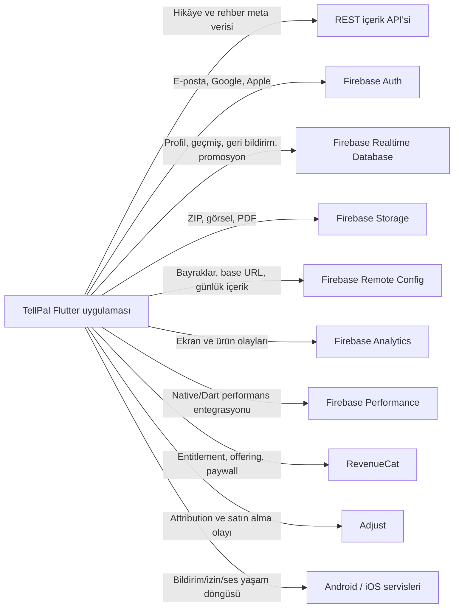

# TellPal Backend ve Harici Servis Entegrasyonları

**Tarih:** 2026-07-28  
**Önemli sınır:** Bu repository backend uygulamasını içermez. Mobil uygulama bir REST
backend'e ve birden fazla yönetilen bulut servisine bağlanır.

## 1. Sistem Bağlamı



## 2. REST İçerik Backend'i

Sorumlulukları:

- Hikâye meta verisi ve etkileşimli hikâye ağacı.
- Hikâye ve dinleme kategorileri.
- Arama, benzer içerik ve editör seçimi.
- Ebeveyn rehberi listeleri, kategorileri ve detayları.

Base URL, Remote Config'den alınır. Mobil istemci dil ve uygulama sürümü başlıklarını
ekler. Ayrıntılı endpoint listesi için [API Contracts](./api-contracts.md) belgesine
bakın.

## 3. Firebase Auth

Kullanılan yetenekler:

- E-posta/parola kayıt ve giriş.
- E-posta doğrulama.
- Parola sıfırlama action link'i.
- Google ile giriş.
- Apple ile giriş.
- Oturum kapatma.
- Hesap silme ve gereken durumlarda yeniden kimlik doğrulama.

Auth UID, Realtime Database kullanıcı profilinin ve RevenueCat kullanıcı kimliğinin
eşitlenmesinde ortak anahtar olarak kullanılır. Anonim uygulama modu Firebase anonymous
auth ile aynı şey olmak zorunda değildir; kaynakta yerel `is_anonymous` kararı da bulunur.

## 4. Firebase Realtime Database

| Yol | Amaç |
|---|---|
| `users/{uid}` | Kullanıcı profili ve kullanım özetleri |
| `content_histories/{uid}/{date}/{pushId}` | Okuma/dinleme oturumları |
| `feedbacks_v2/{date}/{uid}/{pushId}` | Yeni geri bildirim kaydı |
| `feedbacks/{uid}` | Eski günlük geri bildirim sayımı |
| `promotions/{promoCode}` | Promosyon kodu doğrulaması |

Çevrimdışı kalıcılık uygulama başlangıcında etkinleştirilir. Veritabanı güvenlik kuralları
bu repoda görünmediği için erişim yetkileri ayrıca backend/Firebase projesinde
incelenmelidir.

## 5. Firebase Storage

Sorumlulukları:

- Hikâye medya ZIP'leri.
- Hikâye, özet ve kategori görselleri.
- Avatarlar.
- Dil bazlı duyuru görselleri.
- Yerelleştirilmiş PDF belgeleri.
- Bazı ebeveyn ve sesli içerik varlıkları.

İki farklı hikâye paketleme sözleşmesi Remote Config ile seçilir. Storage, REST ve yerel
dosya önbelleği arasındaki sürüm tutarlılığı kritik bir çapraz servis bağımlılığıdır.

## 6. Firebase Remote Config

Gözlenen anahtar grupları:

### Altyapı ve sürüm

- `api_base_url`
- `current_app_version`
- `is_analytic_enable`
- `animation_speed`
- `app_opening_improvement_change`
- `splash_purchase_config_change`

### Hikâye ve içerik

- `is_one_zip_file_download`
- `story_item_count_to_show`
- `story_save_count`
- `new_image_structure_is_enabled`
- `show_story_premium_lock_image`
- `category_search_back_delay_time`

### Ebeveyn modu

- `parent_book_active_languages`
- `daily_parent_books`
- `parent_mode_text`

### Paywall, reklam ve ticari kararlar

- `is_show_paywall`
- `auto_paywall_after_register`
- `auto_paywall_after_story_completed`
- `special_three_day_paywall`
- `is_show_advertisement`
- `is_show_promotion_code`

### UI ve içerik sunumu

- `is_show_slider`
- `is_show_announcement`
- `onboarding_background_image`
- `profile_text_data`
- `navigation_bar_value`
- `is_show_new_language`
- `is_show_customer_type`
- `is_show_user_busy`
- `count_of_daily_user_feedbacks`
- `rate_min_launches`
- `rate_re_min_days`
- `native_review_dialog`

Remote Config hem operasyonel bayrak hem içerik verisi hem de kritik altyapı adresi
taşır. Yeniden geliştirmede tipli bir config şeması, güvenli default değerler, doğrulama
ve acil geri alma politikası gerekir.

## 7. RevenueCat

RevenueCat şu sorumlulukları üstlenir:

- Premium entitlement durumunu okuma.
- Firebase kullanıcı kimliği ile müşteri kimliğini eşitleme.
- Anonymous → authenticated kullanıcı geçişi.
- Offering ve ürünleri alma.
- Farklı kaynaklardan paywall gösterme.
- Satın alma/restore süreçleri.
- Yerel premium cache ve periyodik yeniden doğrulama.
- Promosyon akışını ürün/teklif sürecine bağlama.

Paywall tetik kaynakları arasında ana ekran, premium içerik, kayıt sonrası ve hikâye
tamamlanması bulunur. Remote Config bu tetiklerin bir bölümünü açıp kapatır.

## 8. Analytics ve Attribution

Firebase Analytics çok sayıda ekran ve ürün olayında kullanılır. Olaylar genel olarak:

- Açılış ve onboarding.
- Giriş/kayıt.
- İçerik gösterimi, başlatma ve tamamlama.
- Arama ve kategori etkileşimi.
- Paywall, satın alma ve promosyon.
- Profil ve ayar davranışları.

Adjust, attribution ve satın alma olayları için kullanılır. Analitik başlatma Remote
Config ile kapatılabilir. İki sistemde aynı olayın farklı adlarla çoğalmasını önlemek için
yeniden geliştirmede tek bir analitik olay sözlüğü gerekir.

## 9. Bildirim ve Platform Servisleri

- Android manifestinde internet, wake lock, foreground service, network state ve reklam
  kimliği izinleri bulunur.
- iOS yapılandırmasında arka plan audio modu bulunur.
- Bildirim izni `permission_handler` üzerinden yönetilir.
- `firebase_messaging` paketi bağımlılıklarda olsa da Dart kodunda doğrudan kullanım
  tespit edilmemiştir.
- `firebase_performance` bağımlılığı bulunur; doğrudan Dart API kullanımı tespit
  edilmemiştir.

Bu durumlar, paketlerin native otomatik entegrasyon için mi yoksa artık kullanılmayan
kalıntılar mı olduğunun yeniden geliştirme öncesinde doğrulanmasını gerektirir.

## 10. Ses Altyapısı

`audio_service` ve `just_audio`, hikâye anlatımı, ninni, meditasyon ve ebeveyn rehberi
seslerini oynatır. `PlayerManager` ortak oynatıcı yaşam döngüsünü koordine eder.

Çapraz kesen davranışlar:

- Ekrandan çıkışta durdurma/temizleme.
- Arka plan/foreground geçişleri.
- Hikâye sayfası sesinin tamamlanmasıyla otomatik ilerleme.
- Anlatım ve arka plan müziği ses düzeyi/öncelik ilişkisi.
- Birden fazla ekranın singleton oynatıcıya erişmesi.

## 11. Entegrasyon Bağımlılık Zincirleri

### Hikâye açma

```text
Remote Config (base URL + paket modu)
  → REST (meta veri + StoryPoint)
  → RevenueCat (erişim)
  → Firebase Storage (medya)
  → yerel dosya sistemi
  → audio_service / just_audio
  → Realtime Database (geçmiş)
  → Analytics
```

### Kullanıcı girişi

```text
Firebase Auth
  → Realtime Database kullanıcı kaydı
  → SharedPreferences profil özeti
  → RevenueCat kullanıcı eşitlemesi
  → Analytics / Adjust bağlamı
```

Bu zincirler retry, timeout ve kısmi başarı davranışlarının servis bazında değil, uçtan
uca tanımlanması gerektiğini gösterir.

## 12. Güvenlik ve Operasyon Bulguları

- Kaynakta bulunan servis anahtarları, kimlikler, tokenlar ve gerçek URL'ler bu belgeye
  kopyalanmamıştır.
- Bazı platform yapılandırmalarında gömülü değerler bulunur; yeniden geliştirmede ortam
  bazlı secret/config yönetimine taşınmalıdır.
- REST auth beklentisi istemciden anlaşılmıyor.
- Firebase Database ve Storage kuralları bu repoda yoktur.
- Remote Config'den gelen base URL ve yapılandırılmış JSON değerleri şema doğrulamasına
  tabi görünmüyor.
- Aynı kullanıcı kimliğinin Firebase, RevenueCat, Adjust ve yerel cache arasında
  senkronizasyonu gözlemlenebilir ve idempotent olmalıdır.

## 13. Kullanılmayan veya Belirsiz Entegrasyonlar

| Paket / servis | Gözlem |
|---|---|
| `firebase_messaging` | Dart importu bulunamadı. |
| `firebase_performance` | Dart API importu bulunamadı; native otomatik ölçüm olabilir. |
| `url_launcher` | Doğrudan kullanım tespit edilmedi. |
| `hive` | Doğrudan iş mantığı kullanımı görülmedi; Dio cache adaptörü üzerinden dolaylı. |

Silmeden önce platform-generated dosyalar, native registrant ve mağaza davranışı
doğrulanmalıdır.

## Kaynak Kanıtları

- `lib/main.dart`
- `lib/injection_container.dart`
- `lib/common/services/`
- `lib/features/**/data/data_sources/remote/`
- `lib/features/**/data/repository/`
- `android/app/src/main/AndroidManifest.xml`
- `ios/Runner/Info.plist`
- `pubspec.yaml`

> Kullanıcının isteği gereği sürüm bazlı Crashlytics rapor/doküman dosyaları
> incelenmemiştir. Bu belge yalnızca uygulama kaynak kodundaki servis sınırlarını
> özetler.
