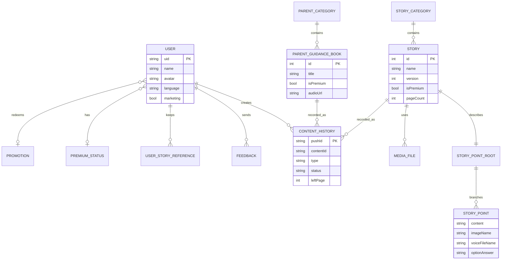

# TellPal Veri Modelleri ve İlişkileri

**Tarih:** 2026-07-28  
**Kaynaklar:** REST modelleri, Firebase Realtime Database işlemleri, SharedPreferences
anahtarları ve yerel dosya önbelleği

## 1. Kavramsal İlişki Haritası



Bu bir ilişkisel veritabanı şeması değildir; farklı depolama sistemlerindeki kavramsal
ilişkileri tek görünümde gösterir.

## 2. Domain Modelleri

### 2.1 Hikâye

`StoryEntity`, REST meta verisinin uygulama içindeki temel karşılığıdır.

| Alan | Tip | Anlam |
|---|---|---|
| `id` | int | Backend içerik kimliği; REST, Storage ve geçmiş kayıtlarını bağlar. |
| `name`, `author`, `summary` | string | Görünen metinler |
| `imageName`, `summaryImageName` | string? | Paket/Storage görsel adları |
| `imageAddress`, `summaryImageAddress` | string? | Yeni görsel yapısında doğrudan adresler |
| `hasVoice` | bool | Sesli anlatım varlığı |
| `dubbing`, `music` | string? | Ses dosyası/meta bilgisi |
| `isMusicActive` | bool | Arka plan müziği davranışı |
| `pageCount` | int | Beklenen sayfa sayısı |
| `version` | int | Yerel içerik klasörü geçerlilik anahtarı |
| `isFullImage` | bool | Sayfa yerleşim davranışı |
| `illustrator` | string? | İllüstratör |
| `duration`, `ageRange` | string? | İçerik meta bilgisi |
| `isNew`, `isPremium` | bool | Vitrin ve erişim işaretleri |

### 2.2 Hikâye Kategorisi

`StoryCategoryEntity` alanları `id`, `name`, `description`, `type`, `imageUrl`,
`isPremium` değerleridir. `CategoryWithStoriesEntity`, bir kategori ile o kategoriye
ait `StoryEntity[]` listesini birlikte taşır.

Kategori tipleri:

- `STORY`
- `LULLABY`
- `AUDIO_STORY`
- `MEDITATION`

### 2.3 Etkileşimli Hikâye Ağacı

`StoryPointEntity` içerik metni, görsel adı, ses dosyası, seçenek cevabı ve sonraki
düğümleri tutar. İlişki özyinelemelidir:

```text
StoryPoint
  ├─ next[0] → StoryPoint
  └─ next[1] → StoryPoint   # varsa kullanıcı seçimi
```

UI bu ağacı kalıcı olarak değiştirmeden seçilen dala göre doğrusal sayfa listesi üretir.

### 2.4 Ebeveyn Rehberi

`ParentGuidanceBookEntity`:

- Kimlik: `id`
- Sunum: `title`, `author`, `summary`, `info`, `imageUrl`
- İçerik: `content`, `audioUrl`, `duration`
- Erişim: `isPremium`

`ParentGuidanceBookCategoryEntity` kategori bilgilerini taşır.
`CategoryWithParentGuidanceBooksEntity`, kategori ile rehber listesini birleştirir.

### 2.5 Profil Taşıma Modelleri

Profil ekranları; kullanıcı adı, doğum tarihi/yaş bilgisi ve avatarı taşıyan
`ProfileIfoEntity` gibi UI/domain taşıma nesneleri kullanır. GoRouter `state.extra`
üzerinden iletildiği için bunlar URL ile yeniden üretilebilir modeller değildir.

## 3. Firebase Realtime Database

### 3.1 Kullanıcı

Yol:

```text
users/{uid}
```

Kaynakta iki nesil profil alanı görülür.

| Eski profil alanları | Yeni profil alanları |
|---|---|
| `name` | `name` |
| `birthdate` | `ageRange` |
| `avatar` / avatar URL | `avatar` / avatar URL |
| `customerType` | `mainPurposes[]` |
| `customerBusy` | `favoriteGenres[]` |
| `marketing` | `marketing` |
| Okunan hikâye listesi | Okunan hikâye listesi |
| Toplam okuma süresi | Toplam okuma süresi |

Alan isimlerinin bazıları farklı servis metotlarında evrimleşmiştir. Yeniden geliştirmede
tek sürümlü `UserProfile` şeması, açık migration ve nullable kuralları gerekir.

### 3.2 İçerik Geçmişi

Yol:

```text
content_histories/{uid}/{date}/{pushId}
```

Gözlenen alanlar:

- `contentId`
- içerik adı
- içerik tipi (hikâye / ebeveyn rehberi vb.)
- içerik uzunluğu
- etkileşim/engagement verisi
- başlangıç ve bitiş zamanı
- durum
- kalan sayfa (`leftPage`)

Hikâye ve ebeveyn rehberi aynı genel geçmiş mekanizmasını kullanır. `pushId`, tek bir
okuma/dinleme oturumunu temsil eder.

### 3.3 Geri Bildirim

Yeni yazma yolu:

```text
feedbacks_v2/{date}/{uid}/{pushId}
```

Alanlar `content`, `mail` ve `isAnswer` çevresindedir. Günlük geri bildirim sayısı kontrolü
için eski `feedbacks/{uid}` yolu da okunur. Bu çift şema migration borcudur.

### 3.4 Promosyonlar

Yol:

```text
promotions/{promoCode}
```

Kodun geçerliliği Firebase'den okunur; sonuç RevenueCat satın alma/teklif akışına bağlanır.
Promosyon nesnesinin sunucu tarafı güvenlik kuralları bu repoda mevcut değildir.

## 4. Firebase Storage Veri Düzeni

| İçerik | Yol / düzen |
|---|---|
| Tek paket hikâye | `{storyId}.zip` |
| İki paket hikâye, ilk bölüm | `stories/{storyId}#1.zip` |
| İki paket hikâye, ikinci bölüm | `stories/{storyId}#2.zip` |
| Hikâye kapakları | `cover_images/...` |
| Kategori görselleri | `category_images/...` |
| Avatarlar | `avatars/...` |
| Duyurular | Dil bazlı announcement yolu |
| Yerelleştirilmiş içerik | Dil ve içerik tipine göre ayrılan klasörler |
| Yasal/yardım belgeleri | Yerelleştirilmiş PDF adresleri |

Gerçek Storage URL'leri ve erişim tokenları bu belgede gösterilmez.

### 4.1 Yerel Hikâye Klasörü

```text
<documents>/
  {storyId}-{version}/        # aktif içerik
  {storyId}.zip               # geçici indirme
  <staging-folders>/          # doğrulama ve atomik terfi
```

`storyId + version`, REST modeliyle yerel dosya önbelleği arasındaki ana bağdır. Paket
doğrulaması dosya sayısı, boş dosya ve bazı boyut/bütünlük kontrollerini kapsar.

## 5. SharedPreferences Durumu

Gözlenen genel anahtarlar:

| Anahtar | İşlev |
|---|---|
| `should_show_onboarding` | Açılış yönlendirmesi |
| `is_anonymous` | Anonim kullanıcı kararı |
| `name`, `birthdate`, `age`, `avatarUrl` | Yerel profil özeti |
| `userReadStoryIdList` | Okunan hikâye kimlikleri |
| `language` | UI, REST ve içerik dili |
| `user_type` | Çocuk / ebeveyn modu |
| `first_run`, `first_launch_time` | İlk açılış mantığı |
| `is_show_ad`, `free_date` | Reklam/günlük erişim durumu |
| `is_show_paywall`, `paywall_show_date` | Paywall kararları |
| `cachedAnnouncementImageUrls` | Duyuru görsel önbelleği |
| `last_premium_check` | Üyelik kontrol zamanı |
| `was_previously_premium` | Önceki üyelik durumu |
| kullanıcı bazlı premium anahtarları | RevenueCat durumu için yerel cache |

Bu veriler kaynak doğrusu değildir; Firebase Auth, Realtime Database ve RevenueCat
durumlarının hızlı açılış için yerel kopyalarıdır.

## 6. Diğer Yerel Depolama

- Dio yanıt önbelleği Hive tabanlı `tellpal_cache` deposunu kullanır; açılamazsa bellek
  önbelleğine düşer.
- Flutter cache manager ağ görselleri/dosyaları için ek cache sağlar.
- Firebase Realtime Database çevrimdışı kalıcılığı etkinleştirilir.
- Hikâye ve ses dosyaları uygulama documents alanında tutulur.

Bu dört önbellek katmanı farklı invalidation kuralları kullandığı için dil değişikliği,
çıkış, içerik sürümü ve hesap değişiminde tek bir cache politikası bulunması önemlidir.

## 7. Veri Sahipliği ve Kaynak Doğruları

| Veri | Kaynak doğrusu | Yerel kopya |
|---|---|---|
| Oturum | Firebase Auth | Anonymous/profile tercihleri |
| Kullanıcı profili | Realtime Database `users/{uid}` | SharedPreferences özeti |
| Premium erişim | RevenueCat entitlement | Premium cache |
| Hikâye meta verisi | REST API | Dio/Hive cache |
| Hikâye medya dosyaları | Firebase Storage | Documents klasörü |
| Özellik bayrakları | Remote Config | SDK cache/default |
| Okuma geçmişi | Realtime Database | Okunan ID listesi |
| Dil | Kullanıcı tercihi | SharedPreferences + generated locale state |

## 8. Veri Modeli Riskleri

- Kullanıcı ve geri bildirim için birden fazla şema nesli aynı anda kullanılıyor.
- SharedPreferences anahtarları tip güvenli, merkezî bir şema altında değil.
- Aynı kavramın Auth, Database, RevenueCat ve yerel cache kimlikleri arasında eşitlenmesi
  gerekiyor.
- Geçmiş kayıtları tarih ve push ID ile bölündüğünden bütün kullanıcı geçmişini sorgulama
  ve sıralama maliyetli olabilir.
- Hikâye paket içeriği için manifest/checksum sözleşmesi görünmüyor.
- GoRouter üzerinden nesne taşıma, uygulamanın soğuk başlangıç ve deep-link ile aynı
  ekranı yeniden kurmasını zorlaştırıyor.
- Dil değişimi birden fazla cache katmanını etkiliyor.

## Kaynak Kanıtları

- `lib/features/**/domain/entities/`
- `lib/features/**/data/models/`
- `lib/common/services/firebase_service.dart`
- `lib/common/services/shared_preferences_service.dart`
- `lib/common/services/premium_status_service.dart`
- `lib/injection_container.dart`

> Servis yapılandırmalarındaki gizli değerler ve kullanıcı tarafından hariç tutulan
> Crashlytics rapor/dokümanları incelenmemiş ve belgeye alınmamıştır.
