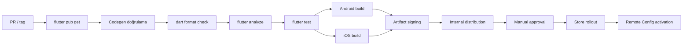

# TellPal Build ve Dağıtım Rehberi

**Tarih:** 2026-07-28  
**Platformlar:** Android ve iOS

## 1. Mevcut Durum

Repository'de GitHub Actions, GitLab CI, Azure Pipelines, Bitbucket Pipelines,
Codemagic, Shorebird veya Fastlane yapılandırması tespit edilmemiştir. Build ve yayın
adımları şu anda yerel/manuel süreçlere dayanıyor görünmektedir.

## 2. Sürüm Kaynakları

| Konum | Gözlenen değer | Rol |
|---|---|---|
| `pubspec.yaml` | `1.0.35+333` | Flutter build name + build number |
| Android Gradle | local properties/Flutter'dan | `versionName` + `versionCode` |
| iOS Xcode project | bazı config'lerde `1.0.11 / 176` | Stale olabilecek native fallback |
| Remote Config | `current_app_version` | Uygulama içi sürüm kararı |

Flutter build komutu pubspec değerlerini platforma aktarabilir; yine de Xcode proje
değerleri ile pubspec arasında görünür drift vardır. Yayın pipeline'ı tek sürüm kaynağı
üretmeli ve Remote Config değerinin ne zaman güncelleneceğini tanımlamalıdır.

## 3. Android

### Yapılandırma

- Application ID: `com.scoustech.interactive_short_kid_stories_tellpal`
- Minimum SDK: 24
- Target/compile SDK: Flutter toolchain'den
- ABI: `armeabi-v7a`, `arm64-v8a`, `x86_64`
- Multidex: etkin
- Signing: `android/key.properties` üzerinden release keystore

### Build

Test APK:

```powershell
flutter build apk
```

Play Store AAB:

```powershell
flutter build appbundle
```

Explicit sürüm:

```powershell
flutter build appbundle --build-name 1.0.35 --build-number 333
```

### Release girdileri

- Release keystore ve `key.properties` güvenli secret store'dan oluşturulmalı.
- Firebase Android config doğru ortamdan sağlanmalı.
- RevenueCat/Adjust/Firebase hedefleri release package ID ile eşleşmeli.
- Play Console subscription/base plan/product eşleşmeleri doğrulanmalı.

## 4. iOS

### Yapılandırma

- Bundle ID: `com.scoustech.interactiveShortKidStoriesTellpal`
- Minimum iOS: 15.0
- CocoaPods: `ios/Podfile`
- Background audio: `Info.plist` yeteneği
- Notification permission: Podfile preprocessor flag'i etkin

Android ve iOS bundle kimliklerinin casing/biçimi farklıdır; harici servis
yapılandırmalarında platforma özgü değerler kullanılmalıdır.

### Build

macOS üzerinde:

```bash
flutter pub get
cd ios
pod install
cd ..
flutter build ipa
```

Xcode signing team, provisioning profile, App Store Connect sertifikaları ve export
seçenekleri yerel/CI secret store üzerinden sağlanmalıdır.

## 5. Firebase ve Harici Servis Release Kontrolü

| Sistem | Kontrol |
|---|---|
| Firebase Auth | E-posta, Google, Apple provider ve redirect/action URL'leri |
| Realtime Database | Production rules, index'ler ve backup |
| Storage | Production rules, CORS/erişim ve içerik dosyaları |
| Remote Config | Base URL, özellik bayrakları, güvenli defaults |
| RevenueCat | Bundle/package IDs, entitlement, offering, ürünler |
| Adjust | Platform app tokenı ve event mapping |
| Apple Sign In | Capability, service/bundle ilişkisi |
| Google Sign In | SHA fingerprint / URL scheme |

Remote Config yayını uygulama binary'sinden bağımsızdır. Özellikle
`is_one_zip_file_download`, `api_base_url` ve paywall bayrakları için change approval ve
rollback planı gerekir.

## 6. Güvenlik Bulgusu

`android/app/google-services.json` ve `ios/Runner/GoogleService-Info.plist` dosyaları Git
tarafından izlenmektedir. Repository kuralı bu dosyaların VCS dışında tutulmasını
istediğinden:

1. İlgili Firebase anahtarlarının kullanım ve kısıtlarını değerlendirin.
2. Gerekiyorsa anahtar/credential rotation yapın.
3. Dosyaları CI secret/file store'dan build sırasında sağlayın.
4. Yalnız `.gitignore` eklemekle yetinmeyin; geçmişteki exposure için repository geçmişi
   ve downstream clone'ları değerlendirin.

Bu belge dosyaların gerçek içeriğini veya anahtarlarını içermez.

## 7. Önerilen CI/CD Kapıları



Önerilen ek kontroller:

- Generated dosya drift kontrolü.
- Secret scanning.
- Asset boyut bütçesi.
- Dependency vulnerability/license taraması.
- Android/iOS package/bundle kimliği ve sürüm tutarlılığı.
- Firebase emulator/sözleşme testleri.
- Hikâye manifest/ZIP fixture doğrulaması.

## 8. Yayın Kontrol Listesi

### Kod kalitesi

- [ ] `dart format` temiz
- [ ] `flutter analyze` hatasız
- [ ] `flutter test` başarılı
- [ ] Generated dosyalar güncel
- [ ] Bağımlılık ve secret taraması tamam

### Ürün davranışı

- [ ] İlk kurulum, anonim, e-posta, Google ve Apple akışları
- [ ] Profil oluşturma ve dil değiştirme
- [ ] Premium satın alma/restore/paywall
- [ ] Hikâye tek ZIP ve iki ZIP modları
- [ ] İlk/ikinci ZIP sınırında hızlı kaydırma
- [ ] Ninni, meditasyon ve ebeveyn rehberi sesi
- [ ] Çevrimdışı/cache ve bozuk dosya toparlama
- [ ] Hesap silme ve çıkış sonrası veri temizliği

### Platform

- [ ] Android release signing
- [ ] iOS signing/provisioning
- [ ] Firebase platform config
- [ ] Store ürün/metin/görsel bilgileri
- [ ] Privacy manifest/policy ve izin açıklamaları
- [ ] Remote Config production değerleri

## 9. Rollout ve Geri Alma

- Önce internal/test grubu, sonra kademeli store rollout kullanın.
- API ve Storage değişikliklerini eski uygulama sürümleriyle geriye uyumlu tutun.
- Remote Config kill switch'lerini güvenli default ile test edin.
- İçerik ZIP sürümünü geri alırken REST `version` ve yerel cache davranışını birlikte
  yönetin.
- Satın alma/entitlement sorunlarında uygulama binary'si, RevenueCat offering ve Remote
  Config bayraklarının bağımsız rollback yollarını tanımlayın.

## Kaynak Kanıtları

- `pubspec.yaml`
- `android/app/build.gradle`
- `android/app/src/main/AndroidManifest.xml`
- `ios/Podfile`
- `ios/Runner/Info.plist`
- `ios/Runner.xcodeproj/project.pbxproj`
- `.gitignore`
