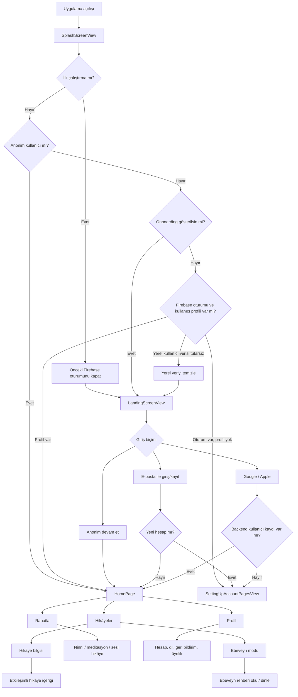
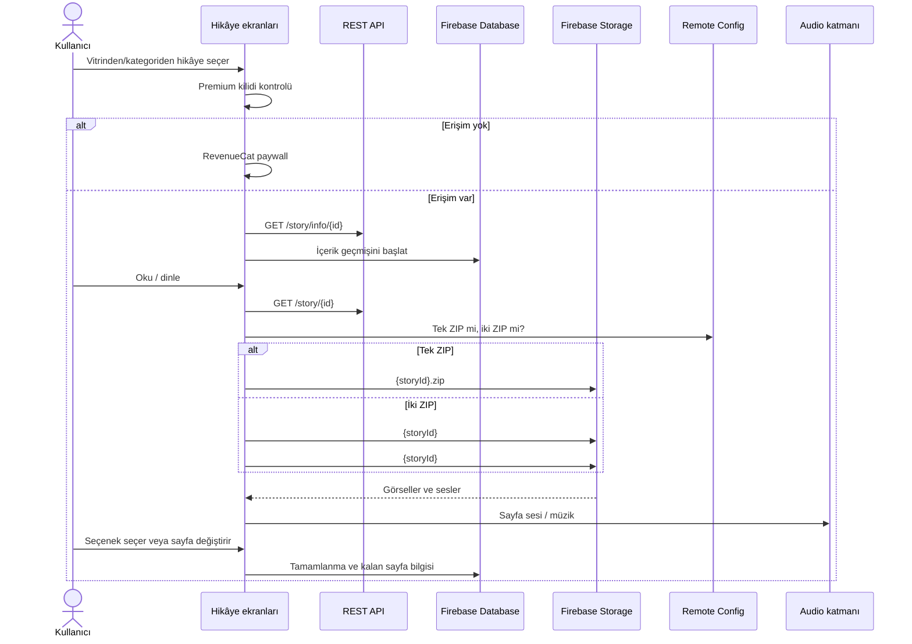
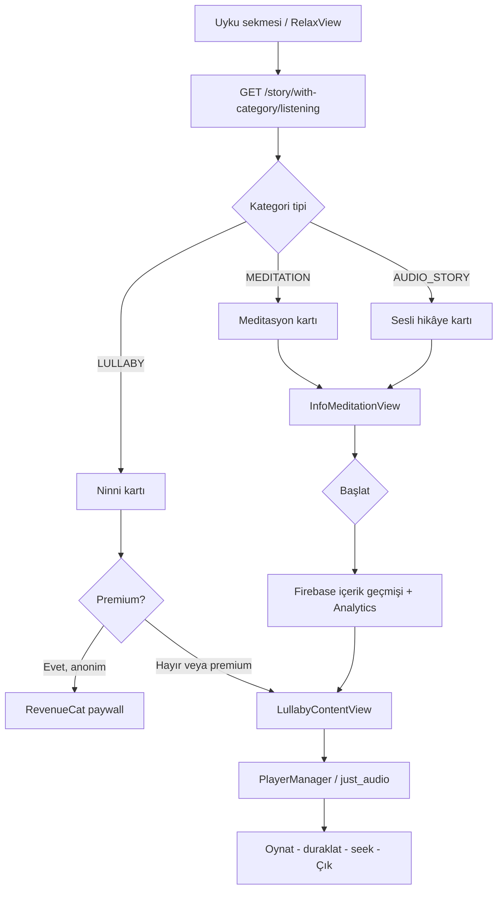
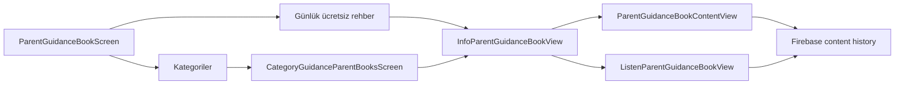

# TellPal Ekran ve Uçtan Uca Akış Haritası

**Tarih:** 2026-07-28  
**Kapsam:** Flutter mobil uygulama (`lib/`)  
**Başlangıç rotası:** `/welcome`

## 1. Yüksek Seviyeli Kullanıcı Yolculuğu

## 2. Navigasyon Yapısı

Uygulama ana navigasyon için `go_router`, bazı detay ekranları için
`PersistentNavBarNavigator` veya doğrudan Flutter `Navigator` kullanır. Bu ikili yapı,
yeniden geliştirmede tek bir navigasyon sözleşmesine dönüştürülmesi gereken önemli bir
tasarım kararıdır.

### 2.1 GoRouter Rotaları

| Rota | Ekran | Girdi / Koşul | Sonraki temel akış |
|---|---|---|---|
| `/` | `SplashScreenView` | Yok | Açılış kararı |
| `/welcome` | `SplashScreenView` | Yok; başlangıç rotası | Landing, profil kurulumu veya ana ekran |
| `/landingScreenView` | `LandingScreenView` | Yok | Anonim, giriş veya kayıt |
| `/onboarding` | `OnboardingView` | Yok | Landing / kayıt |
| `/enterUserProfile` | `SettingUpAccountPagesView` | `extra: bool` pazarlama izni | Profil oluşturma, ana ekran |
| `/registerUser` | `RegisterUserView` | Yok | E-posta doğrulama / profil kurulumu |
| `/login` | `LoginUserView` | Yok | Ana ekran veya profil kurulumu |
| `/authAction` | `ResetPasswordView` veya `EmailVerifyView` | `mode`, `oobCode` sorgu parametreleri | Giriş |
| `/sendResetPassword` | `SendResetPasswordView` | Yok | E-posta ile sıfırlama bağlantısı |
| `/home` | `HomePage(seletcedIndex: 0)` | Yok | Hikâyeler sekmesi |
| `/profile` | `HomePage(seletcedIndex: 2)` | Yok | Profil sekmesi |
| `/storyInfo/:id` | `InfoStoriesView` | Yol parametresi `id`; isteğe bağlı `StoryEntity` | Hikâye içeriği |
| `/storyContent` | `StoryContentView` | Zorunlu `StoryContentPageInputEntity`; eksikse `/` | Etkileşimli okuma |
| `/categoryStories` | `CategoryStoriesScreen` | Zorunlu `CategoryStoriesInput` | İçerik detayı |
| `/ParentGuidanceBook` | `ParentGuidanceBookScreen` | Yok | Ebeveyn rehberi listeleri |
| `/ParentGuidanceBookContent` | `ParentGuidanceBookContentView` | Zorunlu `ParentGuidanceBookEntity`; eksikse `/` | Okuma |
| `/categoryParentGuidanceBooks` | `CategoryGuidanceParentBooksScreen` | Zorunlu kategori + kitap listesi | Rehber detayı |
| `/profileEdit` | `ProfileEditScreen` | Zorunlu `ProfileIfoEntity`; eksikse `/` | Profil güncelleme |
| `/changeLanguage` | `ChangeLanguageView` | Yok | Dil değişikliği ve önbellek yenileme |
| `/deleteAccount` | `DeleteAccountView` | Yok | Yeniden kimlik doğrulama / hesap silme |
| `/profileChangePassword` | `ChangePasswordView` | Yok | Parola güncelleme |
| `/accountSettings` | `AccountSettingsView` | Yok | Hesap alt işlemleri |
| `/feedback` | `UserFeedbackView` | Yok | Firebase geri bildirim kaydı |

### 2.2 Router Dışında Açılan Ekranlar

| Ekran | Açılış biçimi | Kullanım |
|---|---|---|
| `InfoMeditationView` | Persistent nav / Navigator | Meditasyon veya sesli hikâye bilgisi |
| `LullabyContentView` | Persistent nav / Navigator | Ninni ve tek ZIP sesli içerik oynatma |
| `InfoParentGuidanceBookView` | Navigator | Ebeveyn rehberi bilgisi |
| `ListenParentGuidanceBookView` | Navigator | Ebeveyn rehberi sesli oynatma |
| `PDFScreen` | Navigator | Yerelleştirilmiş yasal/yardım PDF'i |

`EnterUserProfileView`, kaynakta bulunan eski/alternatif profil giriş ekranıdır; geçerli
GoRouter yapılandırması profil kurulumunda `SettingUpAccountPagesView` kullanır.

## 3. Ana Ekran ve Modlar

`HomePage` üç kalıcı sekme barındırır:

1. `ReadingStoriesScreen`: hikâye vitrini, kategoriler, arama ve ebeveyn moduna geçiş.
2. `RelaxView`: ninni, meditasyon ve sesli hikâye içerikleri.
3. `UserProfileView`: profil, geçmiş, üyelik ve hesap işlemleri.

Kullanıcı tipi diyaloğu çocuk ve ebeveyn bağlamları arasında geçiş yapar:

- Çocuk modu → `/home`
- Ebeveyn modu → `/ParentGuidanceBook`

Bu seçim hem sunulan içeriği hem de analitik bağlamını etkiler; bağımsız bir yetkilendirme
rolü değildir.

## 4. Kimlik Doğrulama ve Profil Oluşturma Akışı

### 4.1 Açılış Kararı

`SplashScreenView` yaklaşık iki saniyelik ilk beklemeden sonra yerel tercihler, Firebase
oturumu ve Realtime Database kullanıcı kaydını birlikte değerlendirir.

- İlk çalıştırmada mevcut Firebase oturumu kapatılır ve `first_run=false` yazılır.
- Anonim işareti varsa doğrudan ana ekrana geçilir.
- Onboarding işareti varsa landing ekranı açılır.
- Firebase kullanıcısı olup `users/{uid}` kaydı yoksa profil kurulumu açılır.
- Yerel `name` değeri varsa ana ekrana geçilir.
- Durum tutarsızsa dil ve ilk-çalıştırma verileri korunarak diğer yerel veriler temizlenir.

Aynı sırada Remote Config, duyuru görseli hazırlığı, bildirim izni, günlük reklam/paywall
kararları ve RevenueCat eşitlemesi gibi ertelenmiş görevler başlatılır.

### 4.2 Giriş ve Kayıt

| Akış | Kimlik sağlayıcı | Profil kararı |
|---|---|---|
| Anonim devam | Yerel anonim işareti | Profil oluşturmadan ana ekran |
| E-posta kayıt | Firebase Auth | Doğrulama e-postası, ardından profil kurulumu |
| E-posta giriş | Firebase Auth | Var olan kullanıcıyla ana ekran |
| Google giriş/kayıt | Firebase Auth + Google | `users/{uid}` yoksa profil kurulumu |
| Apple giriş/kayıt | Firebase Auth + Apple | `users/{uid}` yoksa profil kurulumu |
| Parola sıfırlama | Firebase e-posta action link | `/authAction?mode=resetPassword` |
| E-posta doğrulama | Firebase e-posta action link | `/authAction?mode=verifyEmail` |

Profil kurulumu kaynakta iki veri biçimiyle görülür. Eski biçim ad, doğum tarihi, avatar,
müşteri tipi ve meşguliyet; yeni biçim ad, amaçlar, yaş aralığı, avatar ve favori türleri
toplar. Her iki akış da kullanıcı kaydını, boş okuma listesini ve toplam süreyi başlatır.

### 4.3 Runtime doğrulaması

- Temiz uygulama verisiyle ilk açılışta bildirim izni istendi; izin sonrasında üç sayfalı
  onboarding açıldı.
- Onboarding sonundaki hesap bottom sheet'i e-posta/Google kayıt, mevcut hesap girişi ve
  hesapsız devam seçeneklerini gösteriyor. Hesapsız devam emülatörde önce otomatik RevenueCat
  paywall denemesi ve `Error 3` üretti; sonraki açılışta anonim kullanıcı ana ekrana ulaştı.
- Anonim profil ekranı `User` başlığı, üyelik çağrısı, bildirim anahtarı, dil, çıkış ve sürüm
  bilgisi gösteriyor. Ücretsiz üyelik çağrısı alternatif `/onboarding` ekranına dönüyor.
- E-posta kayıt ve giriş ekranları runtime'da açıldı. Kayıt formu GDPR ve pazarlama onayı
  istiyor; boş gönderimde GDPR hatası çıkıyor. Giriş formu boş e-posta/parola hatalarını
  ayrı gösteriyor. Parola sıfırlama ekranı kayıtlı e-posta ve doğrulama gönderme aksiyonunu
  içeriyor.
- Test e-posta hesabıyla Firebase Auth kaydı başarıyla tamamlandı. Kayıt sonrası profil
  sihirbazı kullanım amacı, yaş aralığı, favori türler, avatar ve çocuk adı adımlarını
  gösteriyor; her adım `Skip` ile geçilebiliyor.
- Profil sihirbazı tamamlanınca emülatör Billing kısıtı nedeniyle RevenueCat `Error 3`
  verdi. Uygulama yeniden başlatıldığında kayıtlı oturum korunarak ana ekrana dönüldü.
- Kayıtlı profil ekranında varsayılan `User` adı, `0 Finished Story`, `0 Minutes` ve
  e-posta doğrulama uyarısı görüldü. Doğrulama gönderme aksiyonu bu turda çalıştırılmadı.
- Hesap ayarlarından çıkış onaylandı; uygulama ilk onboarding sayfasına döndü. Onboarding
  atlanıp hesap seçeneklerinden aynı e-posta/parola ile giriş yapıldığında ana ekrana dönüş
  başarılı oldu. Doğrulanmamış e-posta login'i bu akışı engellemedi.
- Account Settings → Change Password ekranında `Old Password` ve `New Password` alanları
  bulunuyor; boş gönderimde her iki alan için ayrı `Password field cannot be empty.` hatası
  görülüyor. Gerçek parola bu doğrulamada değiştirilmedi.
- Profil başlığındaki düzenleme simgesi, `Update Profile` ekranına götürüyor. Ekran çocuk
  adı (`User`), profil görseli seçimi ve `Complete` kaydetme aksiyonunu içeriyor; bu turda
  kaydetme çalıştırılmadı.

## 5. Hikâye Akışı

### 5.1 İçerik Seçimi ve Arama

- Ana hikâye vitrini `/story/with-category?count=...` kullanır.
- Kategori ekranı `/story/category/{category_id}` kullanır.
- Arama en az üç karakterden sonra debounce ile `/story/search?search=...` çağırır.
- Premium hikâyeler okunmadan önce RevenueCat erişim durumu kontrol edilir.
- Hikâye bilgisi, rota ile taşınan nesneyi kullanabilir; nesne yoksa REST'ten getirir.

### 5.2 Etkileşimli Hikâye İçeriği

`GET /story/{id}` bir `StoryPoint` ağacı döndürür. Uygulama ağacı doğrusal bir sayfa
yoluna çevirir; iki seçenek görüldüğünde kullanıcı kararı beklenir. Seçimden sonra aktif
yol yeniden kurulur. Sayfa sesinin tamamlanması otomatik ilerlemeyi tetikleyebilir.

Emülatörde `Haberci Nota` normal okuyucu akışı, `Kaan Satranç Öğreniyor` ise bilgi
ekranından başlayıp “Hikâyeyi Bitirdin!” ekranına kadar doğrulandı. Modeldeki
`next`/`optionAnswer` dallanma desteği kaynakta mevcut olsa da bu turda erişilebilir
ücretsiz içerikte seçim kartı açılmadı; seçim adayı premium içerikler Billing olmayan
emülatörde test edilemedi.

### 5.3 Kritik İki ZIP Sınırı

Remote Config `is_one_zip_file_download` kapalı olduğunda:

1. İlk paket `stories/{storyId}#1.zip` indirilir ve ilk sayfalar gösterilir.
2. İkinci paket `stories/{storyId}#2.zip` arka planda indirilir.
3. Kaynak kodda ilk paketin son sayfa indeksi `2` kabul edilir.
4. Kullanıcı indeks `3` veya sonrasına ikinci paket hazır olmadan ulaşırsa yükleme katmanı
   görüntülenir; görsel ve ses yükleme ertelenir.

ZIP işlemi staging klasörü, dosya bütünlük kontrolleri, yeniden deneme ve atomik klasör
değişimi içerir. Bu alan mevcut proje kurallarında kırılgan ve yüksek riskli olarak
işaretlenmiştir. Yeniden geliştirmede açık bir indirme durum makinesi, paket manifesti,
iptal edilebilir görevler ve sayfa/paket bağımlılığının backend sözleşmesine taşınması
önerilir.

Başlıca mevcut hata senaryoları:

- İkinci paket hatasında kullanıcı sınır sayfasında yükleme katmanında kalabilir.
- Hızlı kaydırma, ses tamamlanması ve widget dispose olayları aynı anda yarışabilir.
- Eksik/bozuk görseller paket yeniden indirmesini veya klasör onarımını tetikler.
- Singleton Cubit durumunun ekran kapanırken doğru sıfırlanması gerekir.
- Uygulama sürümü ile hikâye `version` alanının klasör önbelleğiyle uyumlu kalması gerekir.

## 6. Rahatlama İçerikleri

`RelaxView`, `/story/with-category/listening?count=...` ile dört kategori tipinden sesli
içerik toplar: `STORY`, `LULLABY`, `AUDIO_STORY`, `MEDITATION`.

- Ninni: `LullabyContentView`, tek ZIP ve `PlayerManager`.
- Meditasyon: `InfoMeditationView` üzerinden bilgi ve oynatma.
- Sesli hikâye: meditasyon bilgi ekranıyla benzer oynatma akışı.
- Premium içerik: oynatmadan önce üyelik/paywall kontrolü.

### Runtime akışı (emülatörle doğrulanan)

Kartların “Hepsi” bağlantısı kategori kimliği ve tipini `CategoryStoriesInput` ile
`/categoryStories` ekranına taşır. Ninni kartı bilgi ekranını atlayarak oynatıcıya
girer; meditasyon ve sesli hikâye kartları önce ortak bilgi ekranını gösterir. Ortak
oynatıcı ninnide `LoopMode.all`, diğer iki türde `LoopMode.off` kullanır.

## 7. Ebeveyn Modu

- Vitrin `/parent-guidance-book/with-category?count=...` kullanır.
- Günlük ücretsiz kitap kimliği Remote Config'den dil bazında alınır.
- Kategori listesi `/parent-guidance-book/category/{category_id}` kullanır.
- Tek kitap detayı `/parent-guidance-book/{id}` ile getirilebilir.
- Premium kitaplar için paywall kontrolü yapılır.
- Okuma ve dinleme başlangıç/bitiş olayları içerik geçmişine yazılır.

## 8. Profil, Hesap ve Destek Akışları

Profil alanı şu işlevleri toplar:

- Realtime Database'den kullanıcı profilini okuma ve güncelleme.
- Ad, doğum tarihi/yaş aralığı ve avatar düzenleme.
- Dil değiştirme; içerik ve görsel önbelleklerini yenileme.
- Bildirim izni yönetimi.
- E-posta doğrulama ve parola değiştirme.
- Günlük limitli geri bildirim gönderme.
- Okuma/dinleme geçmişini gösterme.
- RevenueCat teklifleri, premium durumu ve promosyon kodu.
- Çıkış ve hesap silme. E-posta kullanıcılarında silme için yakın tarihli yeniden kimlik
  doğrulaması gerekebilir.

## 9. Navigasyon ve Akış Riskleri

| Risk | Kanıt / Etki |
|---|---|
| İki navigasyon mekanizması | Geri davranışı, analitik ve derin bağlantıların tutarlılığı zorlaşır. |
| Tip güvenliği olmayan `state.extra` | Yanlış veya eksik nesne çalışma zamanı hatasına dönüşebilir. |
| Bazı rotalarda eksik girdi koruması | Kategori rotaları `extra` değerini doğrudan cast eder. |
| `/profileEdit/` ve `/profileEdit` kullanımı | Sondaki slash nedeniyle rota eşleşmesi riski bulunur. |
| Auth action bilinmeyen modu | Tanınmayan `mode` doğrudan exception üretir. |
| Splash'ta çok fazla sorumluluk | Navigasyon, izinler, reklam, üyelik ve ön yükleme aynı yaşam döngüsüne bağlıdır. |
| Singleton Cubit yaşam döngüsü | Ekranlar arasında eski veri/durum taşınabilir. |
| İki ZIP içerik sınırı | Hızlı kaydırma ve arka plan indirme yarışı kullanıcıyı bloke edebilir. |

## 10. Yeniden Geliştirme İçin Korunması Gereken Davranışlar

- Anonim kullanım, sosyal/e-posta giriş ve eksik profil tamamlama ayrımı.
- Dilin hem REST `Accept-Language` başlığına hem Firebase içerik yollarına etkisi.
- Çocuk/ebeveyn modu ve günlük ücretsiz ebeveyn rehberi.
- Hikâye ağacında seçim sonrası sayfa yolunun yeniden kurulması.
- Ses, müzik ve otomatik sayfa ilerleme davranışları.
- Premium kilit, paywall tetik kaynakları ve üyelik eşitlemesi.
- Okuma/dinleme geçmişinde başlangıç, bitiş, süre ve kalan sayfa bilgilerinin korunması.
- Çevrimdışı/bozuk dosya koşullarında güvenli içerik önbelleği.

## Kaynak Kanıtları

- `lib/config/routes/app_routes.dart`
- `lib/features/auth/presentation/pages/`
- `lib/features/stories/presentation/pages/`
- `lib/features/parent_mode/presentation/page/`
- `lib/features/profile/presentation/page/`
- `lib/features/relax/presentation/pages/`
- `lib/common/services/firebase_service.dart`
- `lib/injection_container.dart`

> Kullanıcının talebi doğrultusunda sürüm bazlı Crashlytics rapor/doküman dosyaları bu
> incelemeye dahil edilmemiştir.
