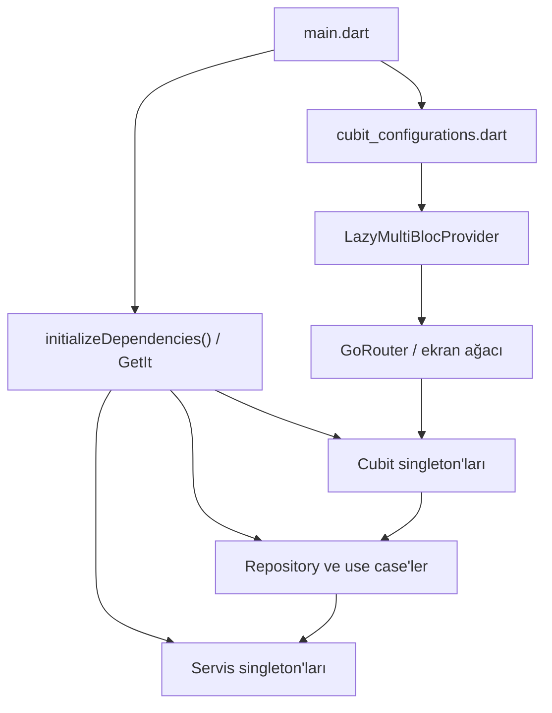

# TellPal Durum Yönetimi ve Bağımlılık Yaşam Döngüsü

**Tarih:** 2026-07-28  
**Temel yaklaşım:** BLoC/Cubit + GetIt + LazyMultiBlocProvider

## 1. Genel Yapı



GetIt; Dio, Firebase servisleri, repository'ler, use case'ler ve Cubit'leri oluşturur.
`LazyMultiBlocProvider`, Cubit'leri öncelik gruplarına göre widget ağacına sağlar.
Cubit'lerin çoğu GetIt singleton'ı olduğu için provider tarafından görünürlükleri lazy
olsa da nesne yaşam döngüleri ekran yaşam döngüsünden uzundur.

## 2. Başlangıç Öncelikleri

| Öncelik | Cubit'ler | Gerekçe |
|---|---|---|
| Kritik | `UserTypeCubit`, `PremiumStatusCubit`, `StorySearchCubit` | Ana ekranın ilk görünümü ve erişim kararı |
| Yüksek/normal | Stories, auth, profil, ebeveyn, relax, içerik ve kategori Cubit'leri | Rota/özellik kullanıldığında |
| Düşük | `StorySecondPartCubit` ve seyrek kullanılan hesap/PDF işlemleri | Açılış maliyetini geciktirme |

Yapılandırma `CubitKeys` ile isimlendirilmiş bir kayıt listesi kullanır. Böylece belirli
Cubit'ler önceden ısıtılabilir veya başlangıç fazına göre geciktirilebilir.

## 3. Cubit Envanteri

### 3.1 Ortak

| Cubit | Sorumluluk |
|---|---|
| `UserTypeCubit` | Çocuk / ebeveyn modu |
| `PremiumStatusCubit` | RevenueCat erişimi, yükleniyor/güncel/hata durumu |

### 3.2 Auth

| Cubit | Sorumluluk |
|---|---|
| `LoginCubit` | E-posta ve sosyal giriş koordinasyonu |
| `RegisterCubit` | Sosyal kayıt |
| `RegisterWithEmailCubit` | E-posta/parola kayıt |
| `VerifyEmailCubit` | E-posta action doğrulaması |
| `SendResetPasswordCubit` | Sıfırlama e-postası |
| `ResetPasswordCubit` | Action code ile yeni parola |
| `EnterUserProfileCubit` | Profil oluşturma |
| `UpdateUserProfileCubit` | Profil güncelleme |
| `PDFLoaderCubit` | Yerelleştirilmiş PDF indirme |

### 3.3 Stories

| Cubit | Sorumluluk |
|---|---|
| `StoriesCubit` | Kategorili hikâye vitrini |
| `CategoryCubit` | Genel kategori listesi |
| `CategoryStoriesCubit` | Tek kategori içerikleri |
| `StorySearchCubit` | Debounce sonrası arama |
| `StoryInfoCubit` | Hikâye meta verisi |
| `StoryContentCubit` | StoryPoint ağacı ve ilk/tek ZIP |
| `StorySecondPartCubit` | İki ZIP modunda ikinci paket |
| `StoryPanelCubit` | Okuma ekranı panel görünürlüğü |
| `NavigationCubit` | Sayfa/navigasyon durumu |
| `ProfileUserStoryCubit` | Kullanıcı geçmişindeki hikâyeler |
| `EditorSelectionStoriesCubit` | Editör seçimi |
| `SimilarContentStoriesCubit` | Benzer içerikler |

### 3.4 Parent Mode

| Cubit | Sorumluluk |
|---|---|
| `ParentGuidanceBookCubit` | Kategorili ebeveyn rehberi vitrini |
| `CategoryParentGuidanceBooksCubit` | Kategori içindeki rehberler |
| `DailyFreeParentGuidanceBookCubit` | Dil bazlı günlük ücretsiz rehber |

### 3.5 Profile ve Relax

| Cubit | Sorumluluk |
|---|---|
| `UserProfileCubit` | Firebase kullanıcı profili |
| `UserProfileSendVerifyMailCubit` | Profil ekranından doğrulama e-postası |
| `ChangePasswordCubit` | Parola değiştirme |
| `DeleteAccountCubit` | Hesap silme |
| `RelaxCubit` | Dinlenebilir kategorili içerikler |

Toplamda kaynakta 31 Cubit sınıfı tespit edilmiştir.

## 4. Durum Akışı Örüntüsü

Tipik uzak veri akışı:

```text
UI event
  → Cubit method
  → UseCase
  → Repository interface
  → Repository implementation
  → Retrofit/Firebase service
  → DataSuccess | DataFailed
  → Loading | Success | Error state
  → BlocBuilder / BlocListener
```

Bu örüntü feature'lar arasında genel olarak tutarlıdır. Buna karşılık ses, ZIP indirme,
premium cache ve açılış koordinasyonu servislerde ek mutable durum tuttuğu için yalnızca
Cubit state'ine bakmak sistemin tam durumunu açıklamaz.

## 5. Çapraz Kesitli Durumlar

### Premium

RevenueCat, `PremiumStatusService`, `PremiumCacheService`,
`PremiumStatusRecoveryService` ve `PremiumStatusCubit` birlikte çalışır. Firebase UID
değişimi ayrıca RevenueCat kimlik eşitlemesini tetikler.

### Ses

`PlayerManager`, `AudioCommandQueue`, `AudioSessionManager` ve ekranların kendi state'i
oynatma durumunu paylaşır. Bir ekranın dispose olması global oynatıcıyı etkileyebilir.

### Hikâye indirme

İlk paket durumu `StoryContentCubit`, ikinci paket durumu `StorySecondPartCubit`, sayfa
indeksi ise `StoryContentView` içinde tutulur. Kullanıcıya gösterilen tek sonuç en az üç
ayrı state kaynağının birleşimidir.

### Açılış

Splash widget state'i, SharedPreferences, Firebase Auth, Remote Config, RevenueCat ve
ertelenmiş görev coordinator'ları birlikte açılış sonucunu belirler.

## 6. Yaşam Döngüsü Riskleri

| Risk | Etki |
|---|---|
| Cubit singleton'ları | Eski success/error verisi başka ekrana taşınabilir. |
| Provider ve GetIt sahipliğinin karışması | Cubit'i kimin kapatacağı belirsizleşebilir. |
| Servislerde gizli mutable state | UI yalnızca Cubit state'ini gözlemleyerek tutarlı görüntü kuramayabilir. |
| Story state'inin bölünmesi | İlk/ikinci paket ve sayfa indeksi yarış koşulu yaratır. |
| Global oynatıcı | İki içerik ekranının aynı kaynağı yönetme riski bulunur. |
| Fire-and-forget başlangıç işleri | Hata ve iptal davranışı ekrandan kopuk kalabilir. |

## 7. Yeniden Geliştirme İçin Önerilen Sınırlar

- Uygulama oturumu: kimlik, profil, dil ve premium durumunu tek açık sözleşmede birleştir.
- Feature-scoped state: ekran/akış Cubit'lerini route kapsamına al; gerçekten global
  durumları ayrı tut.
- Hikâye okuyucu: indirme, sayfa yolu, ses ve UI panelini tek durum makinesinde modelle.
- `idle/loading/ready/partial/error/retrying/completed` gibi ayrık durumlar kullan.
- Her async iş için iptal, retry, timeout ve idempotency davranışını tanımla.
- Service locator erişimini composition root ile sınırla; constructor injection'ı koru.
- Deep link ile ekranın yalnızca ID üzerinden yeniden kurulabilmesini sağla.

## Kaynak Kanıtları

- `lib/injection_container.dart`
- `lib/common/components/cubit/cubit_configurations.dart`
- `lib/common/components/cubit/lazy_bloc_provider.dart`
- `lib/features/**/presentation/cubit/`
- `lib/common/services/`
