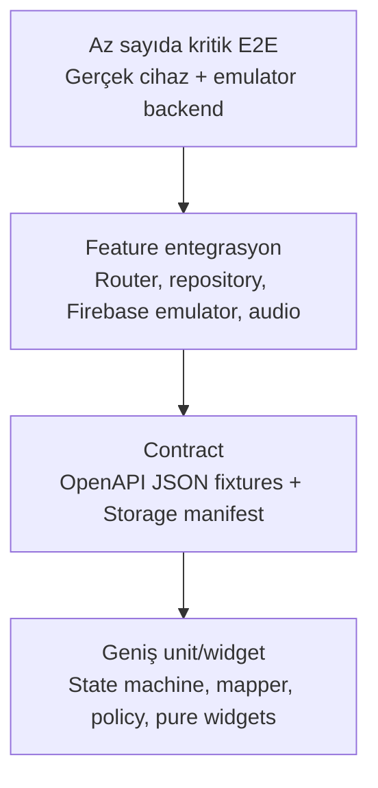

# TellPal Test Tabanı ve Yeniden Geliştirme Test Stratejisi

**Tarih:** 2026-07-28  
**Mevcut framework:** `flutter_test`

## 1. Mevcut Test Envanteri

`test/` altında 27 adet `*_test.dart` dosyası ve bir bozuk görsel fixture'ı bulunur.
Kaynakta toplam 88 `test(...)` / `testWidgets(...)` çağrısı tespit edilmiştir.

| Alan | Test dosyası | Kapsam özeti |
|---|---:|---|
| Common service/widget | 19 | Görsel/dosya bütünlüğü, ZIP, ağ retry, audio, startup ve servis guard'ları |
| Feature | 5 | Onboarding, profil adımı, günlük ebeveyn kitabı, profil modeli, story voice policy |
| Config | 1 | Tema/font ailesi |
| Utils | 1 | ANR monitor yaşam döngüsü |
| Kök | 1 | Lazy Bloc provider |

Kullanıcının talebiyle sürüm bazlı Crashlytics rapor/doküman dosyaları bu analizin
kaynağı değildir.

## 2. Güçlü Mevcut Alanlar

- Hikâye ZIP çıkarma ve klasör korumaları.
- Ağ retry ve görsel bütünlüğü.
- Audio komut sırası ve lifecycle regresyonları.
- RevenueCat config, identity ve attribute queue guard'ları.
- Firebase auth reload / realtime operation guard'ları.
- Startup deferred task koordinasyonu.
- Safe file image davranışı.
- Story sayfa voice policy'nin izole kuralları.

Bu testler özellikle sonradan eklenmiş runtime korumalarının geri dönmesini engelleyen
değerli karakterizasyon testleridir.

## 3. Kritik Test Boşlukları

| Öncelik | Boşluk | Risk |
|---|---|---|
| P0 | İki ZIP sınırında hızlı kaydırma E2E | Blocking overlay, eksik görsel veya yanlış ses |
| P0 | Auth → profil → home entegrasyonu | Kullanıcı açılışta yanlış rotaya düşebilir |
| P0 | Premium entitlement/paywall/satın alma | Ücretli içerik yanlış kilitlenebilir/açılabilir |
| P1 | REST contract fixture testleri | Backend alan değişimi runtime'da kırılır |
| P1 | Router/deep-link testleri | `extra` ve action link rotaları kırılır |
| P1 | Audio interruption/background | Aynı anda iki ses veya takılı player |
| P1 | Cache/dil/hesap invalidation | Başka dil veya kullanıcı verisi görünür |
| P1 | Parent mode kritik yolculuğu | Günlük/premium rehber erişimi bozulur |
| P1 | Account delete/re-auth | Hesap kısmen silinir veya oturum kalır |
| P2 | UI erişilebilirlik/golden | Yeniden geliştirmede görsel ve semantic sapma |

## 4. Hedef Test Piramidi



### Unit

- Story reader state machine.
- StoryPoint ağacını aktif yola çevirme.
- Premium access policy.
- Splash/session karar tablosu.
- Cache invalidation policy.
- Remote Config parse ve default doğrulaması.
- Model mapper'ları.

### Widget

- Her ekranın loading/success/empty/error durumları.
- Tipli route parametreleri.
- Metin ölçekleme ve semantic label.
- Premium kilit görünümü.
- Story boundary overlay ve retry.

### Contract

- REST JSON fixture → model dönüşümü.
- Bilinmeyen/eksik alan davranışı.
- Error response şemaları.
- Storage manifest ve ZIP checksum.
- Remote Config JSON değerleri.

### Integration

- Firebase Auth + Realtime Database emulator.
- RevenueCat adapter için fake/test customer.
- Dio MockWebServer benzeri kontrollü backend.
- Yerel file system ve corrupt archive.
- Audio adapter fake'i ile interruption/queue.

### E2E

- İlk kurulum → anonim → içerik.
- E-posta kayıt → doğrulama → profil → home.
- Google/Apple var profil ve eksik profil varyantları.
- Premium satın alma/restore.
- Tek ZIP ve iki ZIP hikâye tamamlama.
- İki ZIP sınırında hızlı ileri/geri swipe.
- Dil değiştirme ve yeniden açılış.
- Parent günlük ücretsiz kitap.
- Çıkış ve hesap silme.

## 5. Hikâye Okuyucu Karakterizasyon Matrisi

| Paket | Ağ | Kullanıcı hareketi | Beklenen |
|---|---|---|---|
| Tek ZIP | Başarılı | Normal sayfa | Görsel/ses ve tamamlama |
| Tek ZIP | Kesintili | Retry | Aktif klasör bozulmadan toparlama |
| İki ZIP | İkinci hızlı | Sınırı geç | Overlay görünmeden/çok kısa geçiş |
| İki ZIP | İkinci yavaş | İndeks 3'e swipe | Blocking overlay, sonra doğru sayfa |
| İki ZIP | İkinci hatalı | İndeks 3'e swipe | Açık hata + retry/geri dönüş; sonsuz loading yok |
| İki ZIP | İkinci tamamlanırken | Hızlı geri/ileri | Doğru görsel ve tek audio session |
| Her iki | Bozuk görsel | Sayfayı aç | Onarım/retry, çalışan klasör korunur |
| Her iki | Ekran kapanır | Download sürüyor | Dispose sonrası UI callback yok |
| Her iki | Story version değişir | Tekrar aç | Yeni sürüm atomik, eski cache kullanılmaz |

Bu matris mevcut davranışı değiştirmeden önce otomasyona alınmalıdır.

## 6. Auth Karar Tablosu

| İlk çalıştırma | Anonim | Firebase user | DB profil | Yerel profil | Hedef |
|---|---|---|---|---|---|
| Evet | - | Herhangi | Herhangi | Herhangi | Oturumu temizle → landing |
| Hayır | Evet | - | - | - | Home |
| Hayır | Hayır | Var | Yok | Herhangi | Profil kurulumu |
| Hayır | Hayır | Var | Var | Var | Home |
| Hayır | Hayır | Yok/tutarsız | - | Yok | Yerel temizlik → landing |

Onboarding tercihi bu kararların önünde ayrıca test edilmelidir.

## 7. CI Kalite Kapısı

Her pull request:

```powershell
flutter pub get
dart run build_runner build --delete-conflicting-outputs
dart format --output=none --set-exit-if-changed lib test
flutter analyze
flutter test
```

Ek olarak generated drift, secret scanning ve en az Android debug build gerekir.
Release tag'lerinde Android AAB, iOS archive ve kritik E2E smoke suite çalışmalıdır.

## 8. Test Verisi ve İzolasyon

- Test kullanıcıları production Firebase'den ayrılmalı.
- Firebase Emulator Suite için seed/migration script'i oluşturulmalı.
- REST fixture'ları sürüm ve dil bazında saklanmalı.
- ZIP fixture'ları: geçerli tek, geçerli iki parça, eksik, bozuk, boş, eski sürüm.
- RevenueCat ve Adjust adapter arkasına alınmalı; testte fake kullanılmalı.
- Her test kendi geçici dizin/cache namespace'ini kullanmalı.
- Saat, ağ ve UUID/push ID üretimi inject edilebilir olmalı.

## 9. Başarı Ölçütü

Yeniden geliştirme ilk üretim yayınına hazır sayılmadan önce:

- P0 yolculukların tamamı otomatik testte yeşil.
- REST ve Storage sözleşmeleri sürümlü.
- Eski ve yeni uygulama aynı karakterizasyon fixture'larında aynı ürün sonucunu veriyor.
- Testler CI'da deterministik; retry ile gizlenen flaky test yok.
- İki ZIP boundary testleri hem emulator hem en az bir düşük/orta seviye fiziksel cihazda
  doğrulanmış.
