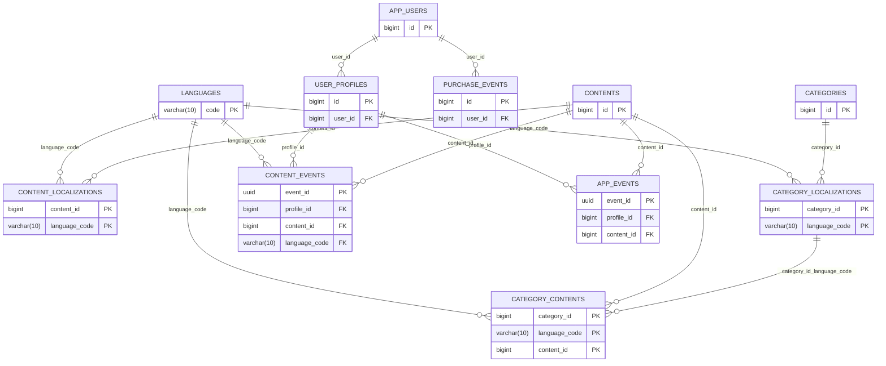
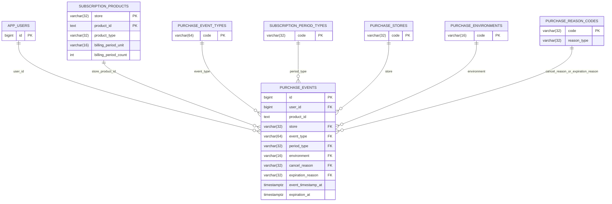

# DB Tasarımı (V2) — Başlangıç Şeması

Bu doküman, yeni Tellpal versiyonu için PostgreSQL üzerinde **çok dil**, **CMS ile yönetilebilir içerik**, **offline-first history/event**, ve **admin auth** ihtiyaçlarını karşılayacak başlangıç şemasını tanımlar.

SQL migration: `src/main/resources/db/migration/V2_0_0__init_v2_schema.sql`
Ek migration: `src/main/resources/db/migration/V2_0_1__add_download_url_to_media_assets.sql`

---

## 1) Hedefler

- **Çok dil**: içerik ve kategori publish’i dil bazında yapılır; çevirisi olmayan dilde içerik görünmez.
- **Lineer story**: branching/options yok; story sayfa akışı deterministik.
- **Offline-first**: mobil event’leri offline queue → batch sync; DB tarafında idempotent insert.
- **Analytics-ready**: “son 30 günde X yaş grubu en çok ne okudu?” gibi sorgular SQL ile yapılabilir.
- **Admin ayrımı**: admin kullanıcıları uygulama kullanıcılarından ayrıdır; Firebase Auth kullanılmaz (JWT username/password).
- **Media**: dosyalar Firebase Storage’ta; Postgres sadece referans/path tutar.

---

## 2) Şema Özeti (Tablolar)

### 2.1 Dil ve Media

- `languages`: desteklenen diller (`tr/en/es/pt/de` seed’li).
- `media_assets`: Firebase Storage object path referansları (IMAGE/AUDIO).
  - `download_url`: performans için opsiyonel cache alanı (liste ekranlarında direkt kullanılır).
  - Not: Firebase download URL’leri genelde `token=` query param içerir; bu pratikte “linki bilen erişir” davranışı verdiği için URL’leri loglamamak ve repo/dokümana koymamak gerekir.

#### `media_assets` (taslak kolonlar)

| Kolon | Tip | Not |
| --- | --- | --- |
| `id` | bigint | PK |
| `provider` | varchar(32) | FIREBASE_STORAGE |
| `object_path` | text | Storage path |
| `kind` | varchar(16) | IMAGE/AUDIO |
| `mime_type` | text | Opsiyonel |
| `bytes` | bigint | Opsiyonel |
| `checksum_sha256` | char(64) | Opsiyonel |
| `download_url` | text | Opsiyonel cache (loglama) |
| `created_at` | timestamptz | default now() |

### 2.2 Uygulama Kullanıcıları (Firebase uid → Postgres)

- `app_users`: `firebase_uid` unique (RevenueCat `app_user_id` ile aynı).
- `user_profiles`: şimdilik 1 profil; ileride çoklu profile hazır.
  - `favorite_genres` ve `main_purposes`: `text[]` olarak tutulur (app enum’ları ile aynı string değerler).

### 2.3 İçerik (Content) ve Çeviriler

- `contents`: içerik “kanonik” kaydı (`type`, `is_premium`, `author_name`, `age_range`).
  - `external_key`: CMS + import + deep-link için dil bağımsız, kalıcı anahtar (unique, zorunlu).
- `content_localizations`: içerik dil bazında (`title`, `description`, `cover_media_id`, `audio_media_id`, `status`/`published_at`).
  - `description`: eski sistemdeki `summary` karşılığı.
  - `status`: `DRAFT | PUBLISHED | ARCHIVED`
- Story özelinde:
  - `content_story_details`: STORY tipine özel alanlar (ör. `illustrator_name`, `page_count`).
  - `story_pages`: sayfa çizimi (tüm dillerde aynı) → `illustration_media_id`
  - `story_page_localizations`: sayfa metni + sayfa ses dosyası (dil bazında)

#### 2.3.1 `contents` (taslak kolonlar)

| Kolon | Tip | Not |
| --- | --- | --- |
| `id` | bigint | PK |
| `type` | varchar(32) | STORY/MEDITATION/LULLABY/AUDIO_STORY |
| `external_key` | text | Unique ve zorunlu; CMS/import/deep-link |
| `is_premium` | boolean | default false |
| `author_name` | text | Dil bağımsız |
| `age_range` | int | Tek sayı (örn. 3, 4, 5); nullable |
| `created_at` | timestamptz | default now() |
| `updated_at` | timestamptz | default now() |

#### 2.3.2 `content_localizations` (taslak kolonlar)

| Kolon | Tip | Not |
| --- | --- | --- |
| `content_id` | bigint | PK/FK |
| `language_code` | varchar(10) | PK/FK |
| `title` | text | Zorunlu |
| `description` | text | Eski `summary` |
| `body_text` | text | Meditasyon gibi tek sayfaliklar icin |
| `cover_media_id` | bigint | FK |
| `audio_media_id` | bigint | Tek sayfaliklar icin |
| `narrator_name` | text | Dubbing/narrator |
| `duration_minutes` | int | Dil bazli sure |
| `status` | varchar(16) | DRAFT/PUBLISHED/ARCHIVED |
| `published_at` | timestamptz | Opsiyonel |
| `created_at` | timestamptz | default now() |
| `updated_at` | timestamptz | default now() |

Notlar:
- `body_text` ninni icin bos kalabilir; meditasyon icin gerekebilir.
- `audio_media_id` tek sayfalik tipler (LULLABY/MEDITATION) icin kullanilir.
- `AUDIO_STORY` ve `STORY` metin/sesleri `story_pages` + `story_page_localizations` uzerinden tutulur.

#### 2.3.3 `content_story_details` (STORY ozel)

| Kolon | Tip | Not |
| --- | --- | --- |
| `content_id` | bigint | PK/FK (contents) |
| `illustrator_name` | text | Story icin |
| `page_count` | int | Zorunlu (story sayfa sayisi) |
| `created_at` | timestamptz | default now() |
| `updated_at` | timestamptz | default now() |

#### 2.3.4 `story_pages`

| Kolon | Tip | Not |
| --- | --- | --- |
| `content_id` | bigint | PK/FK |
| `page_number` | int | PK; 1..n |
| `illustration_media_id` | bigint | FK |

#### 2.3.5 `story_page_localizations`

| Kolon | Tip | Not |
| --- | --- | --- |
| `content_id` | bigint | PK/FK |
| `page_number` | int | PK/FK |
| `language_code` | varchar(10) | PK/FK |
| `text_content` | text | Sayfa metni |
| `audio_media_id` | bigint | FK (dil bazli ses) |
| `created_at` | timestamptz | default now() |
| `updated_at` | timestamptz | default now() |

### 2.4 Kategori (Dil bazında publish + sıralama)

- `categories`: kanonik kategori (slug, type, premium).
- `category_localizations`: kategori adı/açıklama/görseli dil bazında + publish.
- `category_contents`: kategori → içerik ilişki tablosu **dil bazında** ve `display_order` ile.
  - FK’ler, aynı dilde hem category localization hem content localization olmasını garanti eder.

### 2.5 History / Event (Offline-first)

- `content_events`: START/EXIT/COMPLETE event’leri (idempotent: `event_id` UUID PK).
  - `occurred_at` (client zamanı) + `ingested_at` (server zamanı) ayrımı.
  - `legacy_event_key`: Firebase import için opsiyonel tekillik (partial unique index).
- `app_events`: monetization attribution event’leri
  - `PAYWALL_SHOWN`, `LOCKED_CONTENT_CLICKED`

### 2.6 Purchase ve Attribution Snapshot

- `purchase_events`: purchase event kaydı (RevenueCat webhook veya client kaynaklı).
- `purchase_context_snapshots`: purchase anında (veya sonrasında) analytics için küçük özet “snapshot”.
  - Önerilen attribution kuralı: purchase’tan geriye 24 saat içinde en son `LOCKED_CONTENT_CLICKED`, yoksa `PAYWALL_SHOWN`.

### 2.7 Admin Auth (CMS)

- `admin_users`: username/password (bcrypt hash).
- `admin_roles`, `admin_user_roles`: yetkilendirme için hazır.
- `admin_refresh_tokens`: refresh token hash (SHA-256) + revoke/rotation alanları.
  - Access token TTL: 1 saat (app config)
  - Refresh token TTL: 30 gün (DB’de `expires_at`)

---

## 3) Kritik Davranışlar (Uygulama Seviyesinde)

- **Publish filtreleri**
  - İçerik listeleme: `content_localizations.status='PUBLISHED'`
  - Kategori listeleme: `category_localizations.status='PUBLISHED'`
  - Kategori içerikleri: `category_contents` + `content_localizations` join (aynı `language_code`)
- **Premium**
  - `contents.is_premium` metadata’dır; kilitlemeyi client yapar.
- **Offline event idempotency**
  - Mobil her event için `event_id` (UUID) üretir, server aynı UUID ile tekrar gelen insert’i “duplicate” sayar.
  - `occurred_at` her zaman client’ın event zamanı olmalı; `ingested_at` otomatik server zamanı.

---

## 4) Örnek Sorgular

### 4.1 Son 30 günde (age_range=ZERO_TO_TWO) en çok tamamlanan story’ler

```sql
select
    e.content_id,
    count(*) as complete_count
from content_events e
join user_profiles p on p.id = e.profile_id
join contents c on c.id = e.content_id
where e.event_type = 'COMPLETE'
  and c.type = 'STORY'
  and p.age_range = 'ZERO_TO_TWO'
  and e.occurred_at >= now() - interval '30 days'
group by e.content_id
order by complete_count desc
limit 50;
```

### 4.2 Bir dilde (ör. `de`) kategori içeriklerini sırayla çekme (publish filtreli)

```sql
select
    cc.display_order,
    cl.content_id,
    cl.title
from category_contents cc
join category_localizations cal
  on cal.category_id = cc.category_id and cal.language_code = cc.language_code
join content_localizations cl
  on cl.content_id = cc.content_id and cl.language_code = cc.language_code
where cc.language_code = 'de'
  and cc.category_id = 123
  and cal.status = 'PUBLISHED'
  and cl.status = 'PUBLISHED'
order by cc.display_order asc;
```

---

## 5) Migration / Import Notları (Firebase → Postgres)

Önerilen sıra:
1. `app_users` upsert (firebase uid ile)
2. Default `user_profiles` oluştur (tek profil; `is_primary=true`)
3. Firebase history kayıtlarını `content_events`’e import et
   - Firebase key → `legacy_event_key`
   - Uygun `event_type` mapping: `START_CONTENT→START`, `LEFT_CONTENT→EXIT`, `FINISH_CONTENT→COMPLETE`

---

## 6) Açık Noktalar (Sonraki İterasyon)

- Content search: ilk etap basit; ileride `pg_trgm`/FTS kararı.
- “Continue reading” için opsiyonel `content_progress` (profile_id, content_id, last_page, updated_at).
- RevenueCat webhook ingest pipeline (signature validation + raw event store).
- CMS audit: content/category değişikliklerinde `created_by/updated_by` (admin user FK) ekleme.

---

## 7) Analitik Odaklı Eklemeler (V2 Yol Haritası)

Bu bölüm, `docs/17_V2_Yol_Haritasi.md` ile hizalama için şemaya eklenmesi planlanan analytics ihtiyaçlarını listeler.

### 7.1 Uygulama Yaşam Döngüsü Eventleri

- `app_events.event_type` setine: `APP_OPENED`, `ONBOARDING_STARTED`, `ONBOARDING_COMPLETED`, `ONBOARDING_SKIPPED`.
- Aktivasyon/drop ölçümü için bu event’ler zorunlu olmalı; `occurred_at` client zamanı olmalı.

### 7.2 Subscription ve MRR Normalize Alanları

#### 7.2.1 `subscription_products` (taslak kolonlar)

| Kolon | Tip | Not |
| --- | --- | --- |
| `store` | varchar(32) | APP_STORE/PLAY_STORE/STRIPE/RC_BILLING vb. |
| `product_id` | text | Play Store’da `subscription_id:base_plan_id` olabilir; ham değer tutulmalı. |
| `product_type` | varchar(32) | SUBSCRIPTION / NON_RENEWING |
| `billing_period_unit` | varchar(16) | DAY/WEEK/MONTH/YEAR |
| `billing_period_count` | int | 1, 3, 12 vb. |
| `entitlement_ids` | text[] veya jsonb | RevenueCat mapping |
| `is_active` | boolean | default true |
| `created_at` | timestamptz | default now() |
| `updated_at` | timestamptz | default now() |

Notlar:
- Birincil anahtar: `(store, product_id)` yeterli; ekstra `id` zorunlu degil.
- Fiyat/ücret bilgisi burada kanonik tutulmaz; gerçek fiyatlar webhook purchase event’lerinden gelir.

#### 7.2.2 `purchase_events` (ek kolonlar ve alan eslemesi)

| Kolon | RevenueCat alanı | Not |
| --- | --- | --- |
| `event_timestamp_at` | `event_timestamp_ms` | Webhook olusturulma zamani; `occurred_at` farkli tutulur. |
| `expiration_at` | `expiration_at_ms` | Aktiflik/bitis analizi icin. |
| `grace_period_expiration_at` | `grace_period_expiration_at_ms` | Sadece BILLING_ISSUE. |
| `auto_resume_at` | `auto_resume_at_ms` | Sadece SUBSCRIPTION_PAUSED. |
| `period_type` | `period_type` | TRIAL/INTRO/NORMAL/PROMOTIONAL/PREPAID. |
| `is_trial_conversion` | `is_trial_conversion` | Sadece RENEWAL. |
| `cancel_reason` | `cancel_reason` | CANCELLATION icin. |
| `expiration_reason` | `expiration_reason` | EXPIRATION icin. |
| `price` | `price` | USD fiyat (double). |
| `price_in_purchased_currency` | `price_in_purchased_currency` | Orijinal para birimi fiyati. |
| `tax_percentage` | `tax_percentage` | Vergi orani. |
| `commission_percentage` | `commission_percentage` | Store komisyonu. |
| `transaction_id` | `transaction_id` | Store transaction id. |
| `original_transaction_id` | `original_transaction_id` | Ilk transaction id. |
| `renewal_number` | `renewal_number` | Trial conversion’lar dahil. |
| `offer_code` | `offer_code` | Varsa. |
| `country_code` | `country_code` | ISO-3166. |
| `environment` | `environment` | SANDBOX/PRODUCTION. |
| `presented_offering_id` | `presented_offering_id` | Varsa. |
| `new_product_id` | `new_product_id` | PRODUCT_CHANGE icin. |

Notlar:
- `occurred_at` = `purchased_at_ms` olarak kullanilir (mevcut alan).
- `revenuecat_event_id` = webhook `id` (idempotency icin kullanilmali).
- Net gelir icin `net_revenue_micros` opsiyonel; hesaplanabilir alanlar (price + tax/commission) mutlaka tutulmali.

### 7.3 Event Taksonomisi ve Doğrulama

- `purchase_events.event_type` için RevenueCat `type` seti: `INITIAL_PURCHASE`, `NON_RENEWING_PURCHASE`, `RENEWAL`, `PRODUCT_CHANGE`, `CANCELLATION`, `BILLING_ISSUE`, `SUBSCRIBER_ALIAS`, `SUBSCRIPTION_PAUSED`, `UNCANCELLATION`, `TRANSFER`, `SUBSCRIPTION_EXTENDED`, `EXPIRATION`, `TEMPORARY_ENTITLEMENT_GRANT`, `INVOICE_ISSUANCE`, `VIRTUAL_CURRENCY_TRANSACTION`, `EXPERIMENT_ENROLLMENT`, `TEST`.
  - DB doğrulaması (check veya lookup) + gelecekte yeni tipler icin esnek yapida tutulmali.
- `app_events.event_type` genişletilmiş seti için aynı doğrulama yaklaşımı.

### 7.4 Şema Değişikliği Olmadan Takip Edilecek Alanlar

- `content_events.session_id` ve `engagement_seconds` kullanımını zorunlu hale getirme; coverage oranı raporda yer almalı.
- Segmentasyon için `metadata`/`payload` içine `app_version`, `platform`, `country` vb. alanların yazılması.

### 7.5 `purchase_events` Taslak Kolon Seti (Mevcut + Yeni)

| Kolon | Tip | Kaynak/Not |
| --- | --- | --- |
| `id` | bigint | Mevcut PK |
| `user_id` | bigint | `app_users` FK |
| `occurred_at` | timestamptz | `purchased_at_ms` |
| `ingested_at` | timestamptz | Server ingest zamani |
| `source` | varchar(32) | REVENUECAT_WEBHOOK/CLIENT |
| `event_type` | varchar(64) | Webhook `type` |
| `product_id` | text | Webhook `product_id` |
| `entitlement_id` | text | Webhook `entitlement_id` (deprecated ama payload’da gelebilir) |
| `store` | varchar(32) | Webhook `store` |
| `price_micros` | bigint | Mevcut alan (legacy/uyumluluk) |
| `currency` | varchar(3) | Webhook `currency` |
| `is_trial` | boolean | Mevcut alan (legacy/uyumluluk) |
| `revenuecat_event_id` | text | Webhook `id` (idempotency) |
| `raw_payload` | jsonb | Tam payload |
| `created_at` | timestamptz | Mevcut |
| `event_timestamp_at` | timestamptz | Webhook `event_timestamp_ms` |
| `expiration_at` | timestamptz | Webhook `expiration_at_ms` |
| `grace_period_expiration_at` | timestamptz | Webhook `grace_period_expiration_at_ms` |
| `auto_resume_at` | timestamptz | Webhook `auto_resume_at_ms` |
| `period_type` | varchar(32) | Webhook `period_type` |
| `is_trial_conversion` | boolean | Webhook `is_trial_conversion` |
| `cancel_reason` | varchar(32) | Webhook `cancel_reason` |
| `expiration_reason` | varchar(32) | Webhook `expiration_reason` |
| `price` | numeric | Webhook `price` (USD) |
| `price_in_purchased_currency` | numeric | Webhook `price_in_purchased_currency` |
| `tax_percentage` | numeric | Webhook `tax_percentage` |
| `commission_percentage` | numeric | Webhook `commission_percentage` |
| `transaction_id` | text | Webhook `transaction_id` |
| `original_transaction_id` | text | Webhook `original_transaction_id` |
| `renewal_number` | int | Webhook `renewal_number` |
| `offer_code` | text | Webhook `offer_code` |
| `country_code` | varchar(2) | Webhook `country_code` |
| `environment` | varchar(16) | Webhook `environment` |
| `presented_offering_id` | text | Webhook `presented_offering_id` |
| `new_product_id` | text | Webhook `new_product_id` |
| `net_revenue_micros` | bigint | Opsiyonel (hesaplanmis net) |

Notlar:
- Yeni alanlar mevcut migration’lara eklenmeden once isimlendirme netlestirilmeli.
- `price_micros`/`price` ikisi birlikte tutulacaksa tekil hesaplarda oncelik `price` olmali.

### 7.6 Lookup/Enum Tablo Taslaklari (Opsiyonel)

| Tablo | Kolonlar | Ornek degerler | Ilgili kolon |
| --- | --- | --- | --- |
| `purchase_event_types` | `code`, `description`, `is_active`, `created_at` | `INITIAL_PURCHASE`, `RENEWAL`, `CANCELLATION`, `EXPIRATION`, `TEST` | `purchase_events.event_type` |
| `subscription_period_types` | `code`, `description`, `is_active`, `created_at` | `TRIAL`, `INTRO`, `NORMAL`, `PROMOTIONAL`, `PREPAID` | `purchase_events.period_type` |
| `purchase_stores` | `code`, `description`, `is_active`, `created_at` | `APP_STORE`, `PLAY_STORE`, `STRIPE`, `RC_BILLING`, `AMAZON`, `TEST_STORE` | `purchase_events.store` |
| `purchase_environments` | `code`, `description`, `is_active`, `created_at` | `SANDBOX`, `PRODUCTION` | `purchase_events.environment` |
| `purchase_reason_codes` | `code`, `reason_type`, `description`, `is_active`, `created_at` | `UNSUBSCRIBE`, `BILLING_ERROR`, `PRICE_INCREASE` | `cancel_reason`/`expiration_reason` |

### 7.7 V2 DB Diyagramlari (Core + Analytics)

#### 7.7.1 Core Schema (Sade)



#### 7.7.2 Analytics Ekleri (V2 Yol Haritasi)



### 7.8 Index ve Unique Notlari (Ozet)

- Unique: `app_users.firebase_uid`, `media_assets(provider, object_path)`, `categories.slug`, `contents.external_key`, `admin_users.username`, `admin_refresh_tokens.token_hash`, `purchase_events.revenuecat_event_id`, `purchase_context_snapshots.purchase_event_id`.
- Partial unique: `content_events(profile_id, legacy_event_key)` (legacy_event_key not null), `app_events(profile_id, legacy_event_key)` (legacy_event_key not null), `user_profiles(user_id)` (is_primary=true).
- Indexler: `content_events` (profile_id/occurred_at, content_id/occurred_at, event_type/occurred_at, session_id), `app_events` (profile_id/occurred_at, content_id/occurred_at, event_type/occurred_at), `purchase_events` (user_id/occurred_at), `purchase_context_snapshots` (user_id/created_at), `admin_refresh_tokens` (admin_user_id/expires_at).
